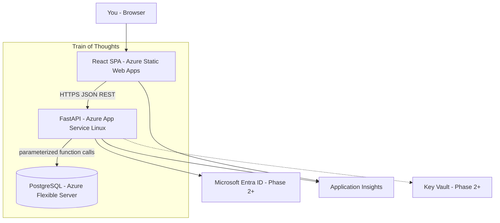

# Train of Thoughts — Project Brief

## Vision

Personal web application to capture, organize, and search thoughts/notes. Built to learn **full-stack development** and **cloud solution architecture**, deployed to **Microsoft Azure**.

---

## Architecture Principles

| Principle | Decision |
|-----------|----------|
| **API layer** | HTTP, auth (JWT/Entra), validation, orchestration (email, external APIs) |
| **Database layer** | **All CRUD** — simple or complex, single or multi-table — via **PostgreSQL functions** |
| **No ORM** | No SQLAlchemy ORM / Django-style models; thin data access with **parameterized SQL** |
| **Security** | Bound parameters only; API DB role has **EXECUTE on functions**, not direct table access |
| **Multi-table writes** | **Functions** (single transaction), not procedures |
| **Frontend** | React + TS; **TanStack Query** for server state |

---

## C4 — Container Diagram (Target State)



---

## Tech Stack

### Frontend

| Item | Choice |
|------|--------|
| Framework | **React 18+** |
| Language | **TypeScript** |
| Tooling | **Vite** |
| Routing | **React Router** |
| Server state | **TanStack Query** |
| HTTP | `fetch` with `VITE_API_URL` |
| Styling | Tailwind **or** CSS Modules (pick one at start) |

### Backend

| Item | Choice |
|------|--------|
| Framework | **FastAPI** |
| Language | **Python 3.12+** |
| Validation | **Pydantic v2** |
| DB driver | **asyncpg** (async, parameterized queries) |
| Auth (Phase 1) | **JWT** (API-owned) |
| Auth (Phase 2+) | **Microsoft Entra ID** (optional migration) |
| API docs | FastAPI OpenAPI (`/docs`) |
| Tests | **pytest** + **httpx** `AsyncClient` |
| Process model (prod) | **Gunicorn + Uvicorn workers** |

### Database

| Item | Choice |
|------|--------|
| Engine | **PostgreSQL** (local Docker → Azure Flexible Server) |
| CRUD | **`app.*` PostgreSQL functions** (`plpgsql` / SQL) |
| Schema migrations | **Versioned SQL files** in repo (e.g. `db/migrations/`) |
| Function deployment | Same pipeline as migrations, ordered scripts |
| Reads (simple joins) | **Views** where static; **functions** when parameterized |
| Multi-table CRUD | **Functions** with `SECURITY DEFINER` + `SECURITY INVOKER` reviewed per function |

### Azure (Production)

| Component | Service |
|-----------|---------|
| Frontend | **Azure Static Web Apps** |
| API | **App Service (Linux)** |
| Database | **Azure Database for PostgreSQL — Flexible Server** |
| Secrets | **Key Vault** (Phase 2+) |
| Monitoring | **Application Insights** |
| CI/CD | **GitHub Actions** |

### Repository Layout (Suggested)

```text
train-of-thoughts/
├── backend/                 # FastAPI
│   ├── app/
│   │   ├── main.py
│   │   ├── api/             # routes (thin)
│   │   ├── schemas/         # Pydantic request/response
│   │   ├── services/        # auth, orchestration
│   │   └── db/              # asyncpg pool, function callers
│   └── tests/
├── frontend/                # Vite + React + TS
├── db/
│   ├── migrations/          # 001_schema.sql, 002_functions.sql, ...
│   ├── functions/           # optional: source-of-truth function defs
│   └── roles/               # GRANT/REVOKE scripts
├── docs/
│   ├── architecture/        # C4, NFR, ADRs
│   └── runbooks/
└── .github/workflows/
```

---

## Non-Functional Requirements (NFRs)

| ID | Category | Requirement | Target / Note |
|----|----------|-------------|---------------|
| **NFR-01** | Availability | Personal-use uptime | **99%** monthly (~7h downtime/month acceptable) |
| **NFR-02** | Performance | API read operations | **p95 < 500 ms** for list/get/search at personal scale |
| **NFR-03** | Performance | API write operations | **p95 < 1 s** for multi-table function calls |
| **NFR-04** | Scalability | Concurrent users | **1 now**; design for **≤ 10** without redesign |
| **NFR-05** | Security | Transport | **HTTPS only** in all non-local environments |
| **NFR-06** | Security | SQL access | **No dynamic SQL concatenation** in app; **parameterized** function calls only |
| **NFR-07** | Security | DB privileges | API role: **`EXECUTE` on `app.*` functions only**; no direct DML on tables |
| **NFR-08** | Security | Secrets | No secrets in git; **App Service settings** → **Key Vault** in Phase 2 |
| **NFR-09** | Privacy | Data ownership | Personal notes; **no third-party analytics on note content** in v1 |
| **NFR-10** | Reliability | Backup | Azure Postgres automated backup; **7-day retention** minimum |
| **NFR-11** | Reliability | RPO / RTO | **RPO 24h**, **RTO 4h** (personal app) |
| **NFR-12** | Cost | Azure spend | **≤ $25/month** in production |
| **NFR-13** | Maintainability | DB changes | All schema + functions **version-controlled** and applied via repeatable migration pipeline |
| **NFR-14** | Observability | Production debugging | **Application Insights**; structured logs; **`/health`** endpoint |
| **NFR-15** | Portability | Vendor coupling | Accept **Postgres-specific** functions; document in ADR |

---

## Architecture Decision Records (ADRs)

### ADR-001: FastAPI + React Decoupled SPA

**Status:** Accepted

**Context:** Personal learning project; need modern API + rich UI.

**Decision:** React SPA (Static Web Apps) + FastAPI REST API (App Service).

**Consequences:** CORS configuration required; two deployables; clear separation of concerns.

---

### ADR-002: PostgreSQL Functions Own All CRUD

**Status:** Accepted

**Context:** Prefer DB as specialized layer; all data operations in database regardless of complexity.

**Decision:** Application calls **`app.*` functions** only; no ORM; no ad-hoc table SQL in Python.

**Consequences:** Strong encapsulation and least-privilege security; requires PL/pgSQL/SQL skill; migrations must include function definitions; Postgres coupling accepted (NFR-15).

---

### ADR-003: Functions Over Procedures for API CRUD

**Status:** Accepted

**Context:** Multi-table operations must be atomic and return data to the API.

**Decision:** Use **`CREATE FUNCTION`** for all API-driven CRUD; reserve **`CREATE PROCEDURE`** for future batch/admin jobs only.

**Consequences:** Single-transaction semantics; easy `SELECT * FROM app.fn(...)` from asyncpg.

---

### ADR-004: SQL Injection Defense via Parameterized DB Calls

**Status:** Accepted

**Context:** Security requirement; historical stored-proc pattern.

**Decision:** App uses **bound parameters** (`$1`, `$2`) calling functions; no string-built SQL in API. Functions use static SQL or safe dynamic SQL only when necessary.

**Consequences:** ORM not required for safety; dynamic SQL inside functions must follow Postgres quoting rules.

---

### ADR-005: SECURITY DEFINER Functions + Restricted API DB Role

**Status:** Accepted

**Context:** API user must not have direct table access.

**Decision:** Functions run as **`SECURITY DEFINER`** (owned by privileged DB role); API role gets **`GRANT EXECUTE`** only. Input validation at API (Pydantic) and in functions where business rules apply.

**Consequences:** Must audit definer functions carefully; owner role is sensitive.

---

### ADR-006: No ORM — asyncpg Data Access Layer

**Status:** Accepted

**Context:** DRF/Django ORM rejected; prefer explicit SQL boundary.

**Decision:** **asyncpg** connection pool; thin Python module per domain calling named functions.

**Consequences:** Manual mapping to Pydantic schemas; more SQL authoring; full control over DB layer.

---

### ADR-007: TanStack Query for Frontend Server State

**Status:** Accepted

**Context:** Avoid duplicated loading/error/refetch logic across React screens.

**Decision:** **TanStack Query** for queries/mutations; invalidate cache after writes.

**Consequences:** Adds one dependency; significantly simpler list/detail/create flows.

---

### ADR-008: JWT Auth First, Entra ID Later

**Status:** Accepted

**Context:** Balance speed of MVP vs Azure identity learning.

**Decision:** **Phase 1:** JWT (single-user acceptable). **Phase 2+:** optional **Entra ID** integration.

**Consequences:** Auth migration work later; faster path to working app.

---

### ADR-009: Versioned SQL Migrations (Not ORM Migrations)

**Status:** Accepted

**Context:** Schema and functions live in DB; Alembic tied to SQLAlchemy models is a poor fit.

**Decision:** Ordered SQL migration files (e.g. `001`, `002`, …) applied by a simple runner or tool like **dbmate**, **Flyway**, or **custom script** in CI.

**Consequences:** Own migration tooling choice; keep it simple for v1.

---

### ADR-010: Azure Hosting Topology

**Status:** Accepted

**Decision:** Static Web Apps + App Service + PostgreSQL Flexible Server + Application Insights.

**Consequences:** Aligns with NFR-12 cost target; familiar PaaS path for learning.

---

## MVP Functional Scope (v1)

| Feature | Notes |
|---------|--------|
| Create / read / update / delete thoughts | title, body, timestamps |
| Tags | assign multiple tags per thought |
| Search | keyword search via DB function |
| Auth | JWT — single user |
| Health | `GET /health` |

**Out of v1:** sharing, AI, offline/PWA, real-time sync, email notifications.

---

## Suggested Development Phases

### Phase 0 — Foundation (Before Feature Code)

**Goal:** Repo, docs, local environment.

- Initialize monorepo structure (`backend/`, `frontend/`, `db/`, `docs/`)
- Copy this brief into `docs/architecture/` (NFRs, ADRs, C4)
- Local Postgres (Docker Compose)
- Define `app` schema, roles, and migration runner approach
- Hello-world: FastAPI `/health` + React page calling it
- GitHub repo + basic CI (lint/test only)

**Exit criteria:** `docker compose up` → API + DB + frontend dev server working locally.

---

### Phase 1 — Database-First Core

**Goal:** All CRUD in Postgres functions.

- Migration `001`: tables (`thoughts`, `tags`, `thought_tags`)
- Migration `002`: functions
  - `app.create_thought`
  - `app.get_thought`
  - `app.update_thought`
  - `app.delete_thought`
  - `app.list_thoughts`
  - `app.ensure_tag` / tag assignment (multi-table **function**)
- Migration `003`: roles/grants (API user, definer owner)
- Integration tests against real Postgres (pytest)

**Exit criteria:** CRUD provable via SQL/psql and pytest without UI.

---

### Phase 2 — FastAPI Thin API

**Goal:** HTTP layer over functions only.

- Pydantic schemas mirroring function I/O
- Routes: `/api/thoughts`, `/api/tags`
- asyncpg pool + parameterized callers
- JWT middleware (login endpoint, protected routes)
- CORS for Vite dev origin
- OpenAPI docs

**Exit criteria:** Full CRUD via Postman/curl with JWT.

---

### Phase 3 — React UI

**Goal:** Usable personal app locally.

- Vite + React + TS + React Router
- TanStack Query hooks for thoughts/tags
- Pages: list, detail, create/edit, search
- Basic responsive layout

**Exit criteria:** End-to-end CRUD in browser against local API.

---

### Phase 4 — Production Hardening

**Goal:** Ready for Azure.

- Structured logging + correlation IDs
- Application Insights integration (local optional, prod required)
- Environment-based config
- Error handling conventions (consistent JSON errors)
- DB backup verification notes / runbook draft

**Exit criteria:** Checklist against NFR-01 through NFR-14 satisfied locally.

---

### Phase 5 — Azure Deployment

**Goal:** Live in cloud.

- Provision: Static Web Apps, App Service, PostgreSQL Flexible Server
- GitHub Actions: test → deploy backend → deploy frontend
- Run migrations against Azure Postgres in pipeline (controlled step)
- App Service settings for `DATABASE_URL`, `JWT_SECRET`, `CORS_ORIGINS`
- Custom domain (optional)

**Exit criteria:** Production URL; thoughts persist in Azure Postgres; NFR-12 cost checked.

---

### Phase 6 — Enhancements (Post-MVP)

- Entra ID auth (ADR-008 migration)
- Key Vault for secrets
- Full-text search tuning (`tsvector` in Postgres)
- Materialized views or search function optimization
- Procedures only if batch jobs appear (e.g. archive old thoughts)

---

## Phase Timeline (Rough Guide)

| Phase | Effort (Part-Time) |
|-------|---------------------|
| 0 | 2–3 days |
| 1 | 1 week |
| 2 | 1 week |
| 3 | 1–2 weeks |
| 4 | 3–5 days |
| 5 | 3–5 days |

Adjust to your pace — the **order** matters more than the dates.
