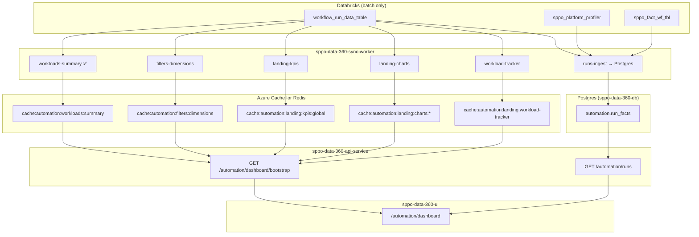

# Automation Dashboard Data Architecture — Personal Design Guide

> **Private learning doc** — lives in `docs/learning/personal/` (gitignored).  
> Project: SPPO Data 360 — Automation route `/automation/dashboard`  
> Written: July 2026

**Related (repo docs):** [sync-worker-redis-payload-contract.md](../../sync-worker-redis-payload-contract.md) · [ui-navigation-bootstrap-and-loading.md](../../ui-navigation-bootstrap-and-loading.md) · [PROJECT_BRIEF.md](../../architecture/PROJECT_BRIEF.md) Phase 3 · Legacy `app.py` `RUNS_SQL` · `static/v2.html` `#t-landing`

---

## 1. The question (design discussion)

> I don't think one huge query should do all the heavy lifting — in future that becomes a challenge. In v2 the filter dropdowns also come from the one run SQL query. With Redis and sync-worker in place, getting everything through one SQL is not the right approach. I'm thinking of breaking it into smaller pieces, leveraging Redis.
>
> v2 limits to 10,000 rows or 90 days. My goal for the new dashboard is **not to limit run count**, but to build architecture so we can get **all the data we need**. Let's discuss system design.

This doc captures that discussion, the v2 baseline, and a **deeper target architecture** for implementation.

### 1.1 Assistant response (agreed direction — July 13, 2026)

**Verdict:** One 10k-row `RUNS_SQL` blob was fine for v2, but it is a poor fit for sync-worker + Redis + API + filters + unbounded history.

**Why the monolith breaks down**

1. Full history × many columns × one JSON blob does not scale in Redis, API, or browser.
2. Precomputing every filter combination in Databricks explodes combinatorially.
3. NFR requires dashboard reads **&lt; 500 ms from cache**, not warehouse per click.
4. KPIs, dropdowns, and run tables have **different grains** — one query shape does not fit all.
5. One failed mega-sync blanks the entire landing page.

**Agreed design principle:** Split by **access pattern**, not one “do everything” query.

| Need | Store |
|------|--------|
| Sidebar workloads | Redis rollup (`workloads-summary` — done) |
| Filter dropdowns | Redis dimension snapshots |
| KPIs, donuts, bars, trends | Databricks `GROUP BY` → small JSON → Redis |
| Workload tracker | Per-workload rollup → Redis |
| Run details (unlimited history) | Postgres `run_facts` + paginated API — **not** one Redis blob |

**“Unlimited runs”** means warehouse and run index are not capped at 10k/90d; the UI still **pages** the detail table (50–200 rows per request).

**Filter + widget sync (v2 did this “for free” in the browser)**

| Pattern | When | Behavior |
|---------|------|----------|
| **1 — MVP** | Ship first | Charts/KPIs = global Redis snapshot; table = filtered Postgres |
| **2** | Later | Filter-aware KPIs computed from Postgres on read |
| **3** | Later | Redis presets for 7d / 30d / 90d date windows |

**Phasing agreed:** (1) workloads-summary ✅ → (2) dimensions + landing rollups + bootstrap API → (3) Postgres ingest + paginated runs → (4) React dashboard → (5) force refresh, filter-aware rollups, CSV.

**vs `react_version`:** Port UI patterns only; do not copy one fat client-side dataset — the multi-job Redis + Postgres index is the target architecture.

Sections §3–§16 below expand this into Redis keys, SQL sketches, Postgres schema, API contracts, and widget mapping.

---

## 2. Executive summary (30-second pitch)

**v2** loads one Databricks query (`RUNS_SQL`, max 10k rows / 90 days), then the browser aggregates everything and builds filter dropdowns from the same array.

**SPPO Data 360** should **split by access pattern**: small **rollup jobs** → Redis for KPIs/charts/dimensions; **incremental run facts** → Postgres for paginated run table + server-side filters; **one bootstrap API** for the UI. Unlimited history means **no artificial row cap in the warehouse**, not “ship all runs to the browser.”

---

## 3. v2 baseline — what we're replacing

### 3.1 Data load

| Piece | v2 |
|-------|-----|
| Endpoint | `GET /api/runs` (`app.py`) |
| SQL | `RUNS_SQL` — joins `workflow_run_data_table`, `sppo_platform_profiler`, `sppo_fact_wf_tbl` |
| Limits | `LIMIT 10000`, `WHERE executed_date >= current_date() - 90 DAYS` (or null date) |
| Server cache | In-memory 30 min (`CACHE_TTL_SECONDS`) |
| UI | `loadData()` → `RUNS[]` → `filtered()` → `render()` |

### 3.2 `RUNS_SQL` output columns (row shape)

These are the fields v2 uses everywhere (landing + usage + filter datalists):

| Column | v2 use |
|--------|--------|
| `wl` | Workload name |
| `prog` | Category / program group (donut colors, tracker) |
| `program` | InternalName (filter) |
| `project` | ExternalName (filter) |
| `sut` | SUT name |
| `user` | Scheduled user |
| `model` | Model / label |
| `date` | Executed date (display string) |
| `result` | Pass / Fail / Other |
| `desc` | Run description / category |
| `wfsch_id` | Schedule ID + PRISM link |
| `import_sheet_id` | Import sheet + link |
| `prism_link`, `import_link` | Reconstructed URLs |
| `stepping`, `opn` | Extra profiler fields |

### 3.3 v2 Landing Page widgets → client-side computation

All from `filtered(RUNS)` in `static/v2.html` `render()`:

| UI block | v2 computation |
|----------|----------------|
| KPI: Workloads | `new Set(data.map(r => r.wl)).size` |
| KPI: Pass / Fail | `filter(isPass)` / `filter(isFail)` |
| KPI: Total runs | `data.length` |
| KPI: Active users | `new Set(data.map(r => r.user)).size` |
| Workload distribution donut | `GROUP BY prog` in JS |
| PRISM result breakdown donut | Pass / Fail / Other buckets |
| Daily run volume (14 days) | `drawLandTrend(data)` |
| Top SUTs (bar list) | `GROUP BY sut`, top 10 |
| Workload tracker table | Per-`wl` stats + sparkline |
| Run details table | Sorted slice, cap **200** rows in UI |
| Top failing workloads | Fail count per `wl`, top 8 |
| User activity bars | `GROUP BY user`, top 8 |
| Result rate by category | `GROUP BY desc`, pass % |
| **Filter dropdowns** | `refreshDynamicFilters()` — distinct values from **all** `RUNS` |

**Key insight:** Filters and widgets share one dataset, so cross-filtering is “free” in the browser — but only because history is capped.

### 3.4 What we already built (monorepo)

| Piece | Status |
|-------|--------|
| `workloads-summary` sync job | Done → `cache:automation:workloads:summary` |
| `GET /api/v1/workloads?source=automation` | Done — sidebar |
| React `/automation/dashboard` | Placeholder only |
| Landing bootstrap / runs API | Not started |

---

## 4. Design principles (agreed direction)

### 4.1 Separate grain, not one mega-query

| Access pattern | Wrong (v2) | Right (Data 360) |
|----------------|------------|------------------|
| Sidebar workload list | Part of 10k runs | Dedicated rollup SQL → Redis ✅ |
| Filter dropdown options | Scan all runs in browser | Dimension snapshot → Redis |
| KPIs + charts | JS over 10k rows | `GROUP BY` in Databricks → small JSON → Redis |
| Workload tracker | JS per workload | Per-workload rollup SQL → Redis |
| Run details table | All rows in memory | **Paginated API** over Postgres (or similar) |

### 4.2 “Unlimited runs” — what it means

| Yes | No |
|-----|-----|
| Sync aggregates over **full retention** (no v2 `LIMIT 10000`) | Return millions of rows in one HTTP response |
| Run index grows with history | One giant Redis JSON blob |
| UI table uses **cursor/page** (50–200 per page) | Browser holds entire history |
| Document retention policy (e.g. 2 years) if needed | Pretend “infinite” without ops plan |

### 4.3 Hot path rules ([NFR.md](../../architecture/NFR.md))

- Dashboard reads: **p95 &lt; 500 ms** from Redis / Postgres — **not** live Databricks per click.
- Databricks: **sync-worker only** (batch); optional fallback later (PROJECT_BRIEF deferred).
- Redis stores **answers**, not raw datasets.

### 4.4 Guardrails

- One failed mega-sync must not block the whole dashboard → **independent jobs** per Redis key.
- Each Redis value stays **small** (target &lt; 1–2 MB per key; shard if needed).
- Reuse envelope pattern: `generated_at`, `source`, `data_source`, `items` / typed payload ([payload contract](../../sync-worker-redis-payload-contract.md)).

---

## 5. Target architecture (diagram)



---

## 6. Redis key catalog (proposed)

Naming convention (extends existing):

```text
cache:<data_source>:<resource>:<shape>[:<variant>]
```

### 6.1 Implemented

| Redis key | Job | Purpose |
|-----------|-----|---------|
| `cache:automation:workloads:summary` | `workloads-summary` | Sidebar: name, group_name, run_count |

### 6.2 Phase A — Landing bootstrap (rollups only)

| Redis key | Job id | Refresh | Approx size |
|-----------|--------|---------|-------------|
| `cache:automation:filters:dimensions` | `filters-dimensions` | 30 min | Small (KB–low MB) |
| `cache:automation:landing:kpis:global` | `landing-kpis` | 30 min | Tiny |
| `cache:automation:landing:charts:result-mix` | `landing-charts` | 30 min | Tiny |
| `cache:automation:landing:charts:by-program` | `landing-charts` | 30 min | Small |
| `cache:automation:landing:charts:runs-by-day` | `landing-charts` | 30 min | Medium (one row per day) |
| `cache:automation:landing:charts:top-suts` | `landing-charts` | 30 min | Small (top N) |
| `cache:automation:landing:charts:top-failures` | `landing-charts` | 30 min | Small |
| `cache:automation:landing:charts:user-activity` | `landing-charts` | 30 min | Small |
| `cache:automation:landing:charts:result-by-desc` | `landing-charts` | 30 min | Small (top N categories) |
| `cache:automation:landing:workload-tracker` | `workload-tracker` | 30 min | Medium (one row per workload) |

**Optional presets (Phase B):**  
`cache:automation:landing:kpis:preset:30d` — precomputed for common date windows without combinatorial explosion.

### 6.3 What does NOT live in Redis

- Full run-level history (millions of rows).
- Arbitrary filter combinations precomputed for every widget.

---

## 7. Sync jobs — SQL sketches

**Catalog / schema:** `{catalog}` = `DBX_CATALOG` (e.g. `prism-prd`), `{schema}` = `DBX_SCHEMA` (e.g. `sppo_prd`).

**Base CTE** (shared pattern from v2 `RUNS_SQL`):

```sql
WITH base AS (
    SELECT
        w.wfsch_id,
        w.import_sheet_id,
        w.workload_name,
        w.category,
        w.sut_name,
        w.scheduled_user_name,
        w.run_description,
        w.executed_date,
        w.wf_result,
        replace(replace(w.label, 'Truin', 'Turin'), 'Sienna', 'Siena') AS label
    FROM `{catalog}`.`{schema}`.workflow_run_data_table w
),
enriched AS (
    SELECT
        b.workload_name AS wl,
        COALESCE(b.category, 'Other') AS prog,
        COALESCE(p.InternalName, 'Unknown') AS program,
        COALESCE(p.ExternalName, 'Unknown') AS project,
        b.sut_name AS sut,
        CASE WHEN b.scheduled_user_name IS NULL
               OR trim(lower(b.scheduled_user_name)) IN ('null','none','')
             THEN 'Unknown' ELSE b.scheduled_user_name END AS user,
        COALESCE(p.model_refined, p.model, b.label) AS model,
        try_to_timestamp(b.executed_date) AS executed_ts,
        COALESCE(NULLIF(trim(f.result), ''),
                 NULLIF(trim(b.wf_result), ''),
                 'NA') AS result,
        b.run_description AS desc,
        b.wfsch_id,
        COALESCE(NULLIF(trim(b.import_sheet_id), ''),
                 NULLIF(trim(f.importSheetId), '')) AS import_sheet_id
    FROM base b
    LEFT JOIN `{catalog}`.`{schema}`.sppo_platform_profiler p
           ON b.wfsch_id = p.workflow_schedule_id
    LEFT JOIN `{catalog}`.`{schema}`.sppo_fact_wf_tbl f
           ON b.wfsch_id = CAST(f.wfScheduleId AS string)
)
```

**No `LIMIT 10000`** on aggregate jobs. Retention `WHERE` is a **product decision** (document explicitly), not v2's hidden cap.

### 7.1 Job: `filters-dimensions`

**Purpose:** Replace v2 `refreshDynamicFilters()` without scanning runs in the browser.

**Option A — one job, one Redis key, multiple arrays:**

```sql
-- Run as separate statements or UNION ALL with a dimension label column
SELECT DISTINCT program FROM enriched WHERE program IS NOT NULL ORDER BY 1;
SELECT DISTINCT project FROM enriched ...
SELECT DISTINCT wl FROM enriched ...
SELECT DISTINCT result FROM enriched ...
SELECT DISTINCT user FROM enriched ...
SELECT DISTINCT sut FROM enriched WHERE sut IS NOT NULL ...
SELECT DISTINCT model FROM enriched ...
SELECT DISTINCT desc FROM enriched WHERE desc IS NOT NULL ...
SELECT DISTINCT wfsch_id FROM enriched WHERE wfsch_id IS NOT NULL ...
SELECT DISTINCT import_sheet_id FROM enriched WHERE import_sheet_id IS NOT NULL ...
```

**Redis payload:**

```json
{
  "generated_at": "2026-07-13T10:00:00+00:00",
  "source": "databricks-live",
  "data_source": "automation",
  "dimensions": {
    "program": ["..."],
    "project": ["..."],
    "workload": ["..."],
    "result": ["..."],
    "user": ["..."],
    "sut": ["..."],
    "model": ["..."],
    "run_description": ["..."],
    "schedule_id": ["..."],
    "import_sheet_id": ["..."]
  }
}
```

**Large dimensions:** For `user` / `sut` with 10k+ distinct values, ship **top 500 by frequency** + add `GET /automation/filters/suggest?field=user&q=sum` against Postgres later.

### 7.2 Job: `landing-kpis` (global snapshot)

```sql
SELECT
    COUNT(*) AS total_runs,
    COUNT(DISTINCT wl) AS workload_count,
    COUNT(DISTINCT user) AS active_users,
    SUM(CASE WHEN lower(result) IN ('pass','passed','success','ok') THEN 1 ELSE 0 END) AS pass_count,
    SUM(CASE WHEN lower(result) IN ('fail','failed','error') THEN 1 ELSE 0 END) AS fail_count
FROM enriched;
```

Maps to v2 KPI row (`k-wl`, `k-pass`, `k-fail`, `k-runs`, `k-users`).

### 7.3 Job: `landing-charts` (split or combined)

| Chart | SQL pattern |
|-------|----------------|
| Result mix | `SELECT result_bucket, COUNT(*) FROM enriched GROUP BY 1` |
| By program | `SELECT prog, COUNT(*) FROM enriched GROUP BY 1` |
| Runs by day | `SELECT date(executed_ts), COUNT(*) FROM enriched WHERE executed_ts IS NOT NULL GROUP BY 1 ORDER BY 1` |
| Top SUTs | `SELECT sut, COUNT(*) c FROM enriched WHERE sut IS NOT NULL GROUP BY 1 ORDER BY c DESC LIMIT 20` |
| Top failures | Per `wl`: total + fail count, `ORDER BY fail_count DESC LIMIT 20` |
| User activity | `GROUP BY user ORDER BY COUNT(*) DESC LIMIT 20` |
| Result by desc | `GROUP BY desc` with pass/total, top 20 by volume |

### 7.4 Job: `workload-tracker`

Per workload (v2 tracker table + sparkline input):

```sql
SELECT
    wl,
    prog,
    COUNT(*) AS run_count,
    SUM(CASE WHEN is_fail(result) THEN 1 ELSE 0 END) AS fail_count,
    -- last result: arg_max(result, executed_ts) or window fn
    -- sparkline: last 14 daily buckets per wl (separate CTE or JSON aggregate)
FROM enriched
GROUP BY wl, prog
ORDER BY wl;
```

**Note:** `workloads-summary` (sidebar) uses **lifetime** counts; tracker may use **same retention** as landing for consistency — document the choice.

### 7.5 Job: `runs-ingest` (Postgres, incremental)

**Purpose:** Unbounded run history for **paginated table** + **server-side filters**.

Not Redis. Incremental watermark on `executed_ts` or `wfsch_id`:

```sql
SELECT ... -- same columns as enriched + executed_ts + links
FROM enriched
WHERE executed_ts > :last_watermark
ORDER BY executed_ts ASC;
```

Upsert into Postgres `automation.run_facts` (see §8).

---

## 8. Postgres `run_facts` (proposed)

Fits PROJECT_BRIEF: “Postgres holds metadata, registry, roles, config” — **run index** is queryable metadata mirroring analytics shape, not parsed metrics in Databricks.

### 8.1 What we store (and what we do not)

**Your instinct is correct:** we store the **enriched, flat row** that v2’s `RUNS_SQL` already produces after joins — **not** the three Databricks tables separately, and **not** by re-running joins on every `GET /runs` request.

```text
v2 today:
  Databricks RUNS_SQL (joins)  →  runs[] in browser  →  Run details table (slice 200)

Data 360:
  Databricks enriched SQL (same joins)  →  sync-worker upsert  →  Postgres run_facts (flat rows)
  GET /runs  →  SELECT ... FROM run_facts WHERE ... ORDER BY ... LIMIT 50  (no joins)
```

| Layer | Joins? | Role |
|-------|--------|------|
| **Sync-worker `runs-ingest`** | **Yes** — same `base` + profiler + fact joins as v2 | Batch ETL: warehouse → Postgres |
| **Postgres `run_facts`** | **No** — one row per run, columns already merged | Indexed store for filter/sort/page |
| **API `GET /runs`** | **No** — query flat table via `fn_list_automation_runs` | Hot path &lt; 500 ms |

Think of Postgres as a **materialized run index**: the **answer shape** v2 already had in each `RUNS[]` element, persisted for unlimited history and server-side pagination.

### 8.2 v2 Run details table → Postgres columns

v2 **Run details** table (`#runs-body` in `static/v2.html`) renders these columns from each run object:

| v2 table column | v2 JSON field | Postgres column | Notes |
|-----------------|---------------|-----------------|-------|
| Schedule ID | `wfsch_id` | `wfsch_id` | **Primary key**; link uses `prism_link` |
| Import Sheet ID | `import_sheet_id` | `import_sheet_id` | Link uses `import_link` |
| Run Description | `desc` | `run_description` | Filter `f-desc` |
| Workload | `wl` | `workload_name` | Filter `f-wl` |
| Program | `program` | `program` | From profiler `InternalName` |
| Project | `project` | `project` | From profiler `ExternalName` |
| SUT | `sut` | `sut_name` | Filter `f-sut` |
| Model | `model` | `model` | `COALESCE(model_refined, model, label)` at ingest |
| User | `user` | `scheduled_user` | Filter `f-user` |
| Date | `date` | `executed_at` | Store **TIMESTAMPTZ** at ingest; API formats `M/d/yyyy` like v2 |
| Result | `result` | `result` | Filter `f-res` |

**Also stored (v2 row shape, not all shown as table columns):**

| v2 JSON field | Postgres column | Used for |
|---------------|-----------------|----------|
| `prog` | `category` | Filters, tooltips, export; drives program grouping color |
| `prism_link` | `prism_link` | Built at ingest from `PRISM_LINK_BASE` + `wfsch_id` |
| `import_link` | `import_link` | Built at ingest from `IMPORT_LINK_BASE` + `import_sheet_id` |
| `stepping` | `stepping` | v2 export / debug; optional in UI |
| `opn` | `opn` | v2 export / debug; optional in UI |
| — | `synced_at` | Ops: when this row was last upserted |

**Not stored in Postgres (handled elsewhere or dropped):**

| Item | Where instead |
|------|----------------|
| Raw `workflow_run_data_table` rows | Stay in Databricks only |
| Profiler / fact tables | Joined **once** at ingest, not stored separately |
| `scheduled_by`, raw `label`, raw `wf_result` | Merged into `model` / `result` at ingest |
| KPIs, donuts, tracker aggregates | Redis rollup keys — **not** in `run_facts` |

### 8.3 Example: one v2 run object → one Postgres row

**v2** (`GET /api/runs` element — simplified):

```json
{
  "wl": "SPEC CPU2017",
  "prog": "CCM",
  "program": "SPEC_CPU",
  "project": "SPEC CPU2017 Rate",
  "sut": "milan-lab-42",
  "user": "jdoe",
  "model": "EPYC 9754",
  "date": "7/10/2026",
  "result": "Pass",
  "desc": "Rate",
  "wfsch_id": "WF-12345678",
  "import_sheet_id": "IS-998877",
  "prism_link": "https://prism.amd.com/prism-web/workflow-runs/workflow/WF-12345678",
  "import_link": "https://prism.amd.com/prism-web/import-sheet/details/IS-998877",
  "stepping": "B0",
  "opn": "100-000001234"
}
```

**Postgres** `automation.run_facts` (same run, typed for query):

```sql
wfsch_id          = 'WF-12345678'
workload_name     = 'SPEC CPU2017'
category          = 'CCM'
program           = 'SPEC_CPU'
project           = 'SPEC CPU2017 Rate'
sut_name          = 'milan-lab-42'
scheduled_user    = 'jdoe'
model             = 'EPYC 9754'
executed_at       = '2026-07-10T00:00:00+00:00'   -- parsed from executed_date at ingest
result            = 'Pass'
run_description   = 'Rate'
import_sheet_id   = 'IS-998877'
prism_link        = 'https://prism.amd.com/.../WF-12345678'
import_link       = 'https://prism.amd.com/.../IS-998877'
stepping          = 'B0'
opn               = '100-000001234'
synced_at         = now()
```

**API page** (`GET /api/v1/automation/runs?limit=50&sort=executed_at&order=desc`) returns the same shape the React table needs — essentially the v2 object with `date` derived from `executed_at`:

```json
{
  "generated_at": "2026-07-13T10:00:00Z",
  "source": "postgres",
  "items": [
    {
      "wfsch_id": "WF-12345678",
      "import_sheet_id": "IS-998877",
      "desc": "Rate",
      "wl": "SPEC CPU2017",
      "program": "SPEC_CPU",
      "project": "SPEC CPU2017 Rate",
      "sut": "milan-lab-42",
      "model": "EPYC 9754",
      "user": "jdoe",
      "date": "7/10/2026",
      "result": "Pass",
      "prism_link": "https://prism.amd.com/.../WF-12345678",
      "import_link": "https://prism.amd.com/.../IS-998877",
      "prog": "CCM",
      "stepping": "B0",
      "opn": "100-000001234"
    }
  ],
  "next_cursor": "eyJleGVjdXRlZF9hdCI6..."
}
```

v2 capped the table at **200 rows** client-side (`sortData(data).slice(0,200)`). Data 360 returns **50 per page** with `next_cursor` — same columns, no 10k cap on total history.

### 8.4 Ingest SQL (joins happen here only)

The sync job runs the **same enriched SELECT** as v2 `RUNS_SQL` (§7 base CTE), but:

- **No `LIMIT 10000`** (or use a documented retention window you own)
- **Incremental:** `WHERE executed_ts > :watermark` after backfill
- **Upsert** on `wfsch_id` so late-arriving profiler/fact updates refresh the row

Postgres never executes `LEFT JOIN sppo_platform_profiler` — that work is done in Databricks during ingest.

### 8.5 Table sketch (migration)

```sql
-- automation.run_facts (name TBD; via migration + fn_* per project rules)
CREATE TABLE automation.run_facts (
    wfsch_id            TEXT PRIMARY KEY,
    workload_name       TEXT NOT NULL,
    category            TEXT,
    program             TEXT,
    project             TEXT,
    sut_name            TEXT,
    scheduled_user      TEXT,
    model               TEXT,
    executed_at         TIMESTAMPTZ,
    result              TEXT,
    run_description     TEXT,
    import_sheet_id     TEXT,
    prism_link          TEXT,
    import_link         TEXT,
    stepping            TEXT,
    opn                 TEXT,
    synced_at           TIMESTAMPTZ NOT NULL DEFAULT now()
);

CREATE INDEX idx_run_facts_executed_at ON automation.run_facts (executed_at DESC);
CREATE INDEX idx_run_facts_workload ON automation.run_facts (workload_name);
CREATE INDEX idx_run_facts_program ON automation.run_facts (program);
CREATE INDEX idx_run_facts_result ON automation.run_facts (result);
-- composite indexes TBD from EXPLAIN on filter queries
```

### 8.2 API: `GET /api/v1/automation/runs`

Query params (v2 filter bar mapping):

| Param | v2 filter |
|-------|-----------|
| `from`, `to` | Date range (`f-range`) |
| `program` | `f-program` |
| `project` | `f-project` |
| `workload` | `f-wl` |
| `result` | `f-res` |
| `user` | `f-user` |
| `sut` | `f-sut` |
| `model` | `f-model` |
| `description` | `f-desc` |
| `schedule_id` | `f-sch` |
| `import_sheet_id` | `f-imp` |
| `sort`, `order` | v2 `sortRuns()` |
| `cursor` / `limit` | Pagination (replace cap 200) |

**Response:**

```json
{
  "generated_at": "...",
  "source": "postgres",
  "items": [ { /* row */ } ],
  "next_cursor": "..."
}
```

Implement via `fn_list_automation_runs(...)` — API role has EXECUTE only, no direct table access (per architecture principles).

---

## 9. API: bootstrap endpoint

**`GET /api/v1/automation/dashboard/bootstrap`**

BFF merges Redis keys in one round trip for the UI loading gate ([bootstrap doc](../../learning/ui-navigation-bootstrap-and-loading.md)):

```json
{
  "generated_at": "...",
  "source": "redis-cache",
  "filters": { /* from filters:dimensions */ },
  "kpis": { /* from landing:kpis:global */ },
  "charts": {
    "result_mix": {},
    "by_program": [],
    "runs_by_day": [],
    "top_suts": [],
    "top_failures": [],
    "user_activity": [],
    "result_by_description": []
  },
  "workload_tracker": []
}
```

UI: single spinner until bootstrap resolves → render dashboard chrome + widgets.

Run table: **separate** `GET /runs` with filters (may load in parallel or after bootstrap).

---

## 10. Filter + widget interaction strategies

v2 re-aggregates all widgets on every filter change. Three patterns for Data 360:

### Pattern 1 — MVP (recommended first)

| Surface | Behavior |
|---------|----------|
| Charts / KPIs | **Global** snapshot from Redis (last sync, ~30 min stale) |
| Filter dropdowns | From `filters:dimensions` snapshot |
| Run details table | **Filtered** via Postgres `GET /runs` |

**UX note:** Label charts “All data (as of {generated_at})”; table respects filters. Honest and shippable.

### Pattern 2 — Filter-aware table + optional KPI recompute

- Table: Postgres (always filtered).
- KPIs: optional **on-read** `COUNT` from Postgres when filters applied (indexed, bounded) — still no Databricks on hot path if index is warm.

### Pattern 3 — Preset rollups in Redis (later)

- Precompute `kpis:global`, `kpis:preset:7d`, `kpis:preset:30d`, `kpis:preset:90d`.
- Date dropdown maps to preset key — avoids combinatorial cache keys.

**Avoid in v1:** Precomputing every combination of (program × project × workload × …).

---

## 11. v2 widget → implementation mapping

| v2 Landing widget | v2 source | Data 360 source | Phase |
|-------------------|-----------|-----------------|-------|
| Filter bar datalists | All `RUNS` | Redis `filters:dimensions` | A |
| KPI row | `render()` counts | Redis `landing:kpis:global` | A |
| Workload distribution donut | `GROUP BY prog` | Redis `charts:by-program` | A |
| Result breakdown donut | Pass/Fail/Other | Redis `charts:result-mix` | A |
| Daily run volume | `drawLandTrend` | Redis `charts:runs-by-day` | A |
| Top SUTs bars | `GROUP BY sut` | Redis `charts:top-suts` | A |
| Workload tracker | Per-`wl` in JS | Redis `workload-tracker` | A |
| Run details table | `RUNS` slice 200 | Live Databricks `GET /runs` paginated (§19) **or** Postgres (§8 Option A) | B |
| Top failing workloads | JS aggregation | Redis `charts:top-failures` | A |
| User activity | JS aggregation | Redis `charts:user-activity` | A |
| Result rate by desc | JS aggregation | Redis `charts:result-by-desc` | A |
| Left sidebar workloads | `deriveWL()` | Redis `workloads:summary` ✅ | Done |
| Export CSV | Filtered `RUNS` | `GET /runs?format=csv` (page loop or warehouse export) | B/C |

## 12. Phased delivery

> **Path update (July 2026):** Phase B run table can use **live Databricks** (NFR-aligned) instead of Postgres ingest. See §19.

### Phase 0 — Done

- [x] `workloads-summary` → sidebar
- [x] `GET /api/v1/workloads?source=automation`

### Phase A — Landing without run table

- [ ] Sync jobs: `filters-dimensions`, `landing-kpis`, `landing-charts`, `workload-tracker`
- [ ] `GET /api/v1/automation/dashboard/bootstrap`
- [ ] React Dashboard page (KPIs + charts + tracker; run table stub until Phase B)

### Phase B — Run details table (choose one path)

**Path B — Live Databricks (recommended; matches NFR + PROJECT_BRIEF)**

- [ ] Unity Catalog **view** `vw_automation_run_enriched` (encapsulates v2 `RUNS_SQL` join logic)
- [ ] `sql/automation_runs_page.sql` in API repo — parameterized `WHERE` + keyset `LIMIT`
- [ ] `GET /api/v1/automation/runs` → API `databricks_repository` (already wired for `/ready`)
- [ ] Run details table in UI

**Path A — Postgres mirror (optional; faster reads, conflicts with NFR data ownership)**

- [ ] Postgres `run_facts` migration + `fn_list_automation_runs`
- [ ] Sync job `runs-ingest` (incremental watermark)
- [ ] `GET /api/v1/automation/runs` from Postgres
- [ ] Run details table in UI

### Phase C — Polish

- [ ] Force refresh (debounced, logged)
- [ ] Filter-aware KPIs (Pattern 2 — Postgres or live aggregate SQL)
- [ ] Databricks fallback on Redis miss (PROJECT_BRIEF deferred)
- [ ] CSV export
- [ ] Preset date rollups in Redis (Pattern 3)

---

## 13. Trade-offs vs alternatives

| Approach | Verdict |
|----------|---------|
| One bigger `RUNS_SQL` in sync worker → one Redis key | **Reject** — same scaling problem as v2 |
| Keep all aggregation in browser | **Reject** — needs full payload; breaks NFR |
| Live Databricks per filter change on **charts/KPIs** | **Reject** for hot path — latency + cost |
| Redis for rollups + **live Databricks** for paginated run rows | **Accept** — matches NFR §2 pagination + PROJECT_BRIEF Phase 3 |
| Redis for rollups + Postgres `run_facts` for rows | **Acceptable** — faster table reads; **tension** with NFR “Postgres holds no workload analytics” |
| Colleague `react_version` client TTL cache of fat JSON | **Port UI patterns only** — not data architecture |

---

## 14. Interview Q&A

**Q: Why not one query like v2?**  
A: v2 capped at 10k/90d and aggregated in JS. Split by grain: small rollups in Redis; run rows via paginated `GET /runs` (Databricks view §19 or Postgres §8).

**Q: How do filters work without one `RUNS` array?**  
A: Dropdown options from Redis dimension snapshot. Run table filters hit Databricks (§19) or Postgres (§8). Charts show global rollups in v1.

**Q: Where does Databricks run?**  
A: Sync-worker for **aggregates** (batch). API may query warehouse for **paginated run rows** per NFR §2. Not for every chart/KPI click.

**Q: How is this different from sidebar `workloads-summary`?**  
A: Sidebar is one aggregate (name, group, count). Landing needs more rollups + paginated row access — same pattern, more keys.

**Q: What about manual `/manual/dashboard`?**  
A: Same pattern later: `cache:manual:*` keys + manual Databricks schema when it exists. Automation first.

**Q: Are we replicating RUNS_SQL with joins into Postgres?**  
A: **Option A only** (§8). **Option B** (§19): joins live in a Databricks **view**; API paginates with no Postgres mirror.

**Q: Can we use a Databricks view instead of Postgres `run_facts`?**  
A: **Yes — NFR and PROJECT_BRIEF prefer live Databricks for deep pagination.** See §19.

---

## 15. FAQ — What exactly lives in Postgres `run_facts`?

> Run details table → Postgres `run_facts` + paginated `GET /runs` — what exactly do we keep in Postgres? I have a feeling you want to replicate the SQL query with joins as in v2 and put data in Postgres.

### Short answer

**Yes — but only the flattened result of that query, not the join logic itself.**

Postgres holds **one denormalized row per workflow run**, matching each element of v2’s `RUNS[]` array after `RUNS_SQL` has already joined `workflow_run_data_table`, `sppo_platform_profiler`, and `sppo_fact_wf_tbl`. The API serves pages from that flat table; it does **not** re-join Databricks tables on each request.

### Mental model

```text
┌─────────────────────────────────────────────────────────────┐
│  Databricks (batch, sync-worker only)                       │
│  RUNS_SQL enriched SELECT  ──joins──►  one row per run       │
└───────────────────────────────┬─────────────────────────────┘
                                │ upsert (incremental)
                                ▼
┌─────────────────────────────────────────────────────────────┐
│  Postgres automation.run_facts  (flat, indexed)               │
│  wfsch_id PK · workload_name · program · result · ...       │
└───────────────────────────────┬─────────────────────────────┘
                                │ fn_list_automation_runs(...)
                                ▼
┌─────────────────────────────────────────────────────────────┐
│  GET /api/v1/automation/runs?filters&cursor&limit=50        │
│  → JSON items[] (same shape v2 Run details table expects)     │
└─────────────────────────────────────────────────────────────┘
```

### v2 Run details table needs these fields

From `static/v2.html` `#runs-body` (lines ~1039–1045): Schedule ID, Import Sheet ID, Run Description, Workload, Program, Project, SUT, Model, User, Date, Result — plus hyperlink fields `prism_link` / `import_link` and tooltip fields (`prog`, etc.). All of that is **one Postgres row** per run after ingest.

### What we are NOT doing

| Misconception | Reality |
|---------------|---------|
| Store 3 normalized tables in Postgres and join on read | **No** — defeats the purpose of the index |
| Run `RUNS_SQL` on every dashboard load | **No** — sync-worker batch only |
| Put full history in Redis as JSON | **No** — Redis is for rollups; rows live in Postgres |
| Duplicate rollup aggregates in `run_facts` | **No** — KPIs/charts stay in Redis keys |

### Pagination vs v2

| | v2 | Data 360 |
|---|-----|----------|
| Total runs available | Max 10,000 (90 days) | Full ingested history |
| Rows shown in table | First 200 after client sort | 50 per API page (`cursor` + `limit`) |
| Sort | `sortRuns(key)` in browser | `sort` + `order` query params → SQL `ORDER BY` |
| Filter | `filtered(RUNS)` in memory | `WHERE` on indexed Postgres columns |

See **§8.1–§8.4** for column mapping, example row, and ingest flow.

> **Note:** §8 describes **Option A — Postgres `run_facts`** (materialized run index). **§19** describes **Option B — Databricks view + live pagination**, which aligns more closely with [NFR.md](../../architecture/NFR.md) and [PROJECT_BRIEF.md](../../architecture/PROJECT_BRIEF.md) Phase 3 exit criteria. Read both before choosing an implementation path.

---

## 16. Mental model — one paragraph

*v2 proved the UX with one `RUNS_SQL` and client-side math. Data 360 keeps the same Landing Page widgets but moves math into batch SQL → Redis for KPIs/charts/filters, and serves the run details table via bounded paginated queries (Databricks view by default per NFR, or optional Postgres mirror). Unlimited runs means no artificial 10k cap — the UI still pages the table. One bootstrap API gives a fast first paint; sync-worker jobs stay small and independent.*

---

## 17. Next design decisions (before coding)

These are the open choices to lock when implementation starts:

| Decision | Options | Recommendation |
|----------|---------|----------------|
| Run table row store | Databricks view + live API (§19) vs Postgres mirror (§8) | **Databricks view** — matches NFR; Postgres only if latency forces it |
| Retention for rollup SQL | Full history vs documented window (e.g. 2 years) | Document explicitly; no hidden `LIMIT 10000` |
| Large dimensions (`user`, `sut`) | Full distinct list vs top-N + typeahead | Top 500 by frequency in v1; typeahead API later |
| `workload-tracker` vs sidebar counts | Same retention vs different | Align retention; sidebar = lifetime count is already shipped |
| Run ingest watermark | `executed_ts` vs `wfsch_id` | **N/A if §19**; if §8: `executed_ts` + upsert on `wfsch_id` |
| Chart filter behavior at launch | Pattern 1 only vs partial Pattern 2 | Pattern 1 (honest “global charts, filtered table”) |
| Bootstrap vs parallel fetches | Single BFF vs multiple Redis reads from UI | Single `GET .../bootstrap` per loading-gate doc |

**Implementation branch:** Build on `staging` monorepo (`sppo-data-360-*`), not `react_version` (unrelated history).

---

## 19. FAQ — Databricks view instead of Postgres `run_facts`?

> Today in Databricks we already have the data. Instead of `run_facts` in Postgres, can we have that structure as a **view in Databricks**? Does that violate architecture? Would API-service access Databricks directly? Can we use stored procedures on Databricks?

### Short answer

**Yes — a Databricks view is valid and arguably *more official* than Postgres `run_facts`** for the run details table.

You **do not violate** architecture if you:

- Keep **landing KPIs/charts/filters** on the **Redis hot path** (sync-worker batch).
- Use **live Databricks SQL** only for **paginated run rows** (`GET /runs`) — which [NFR.md](../../architecture/NFR.md) and [PROJECT_BRIEF.md](../../architecture/PROJECT_BRIEF.md) Phase 3 already describe.
- Route reads through **API → repository → Databricks** (never browser → warehouse).
- Use **bounded** queries (`LIMIT`, keyset cursor, selective `WHERE`) — not full-history dumps.

You **would violate** architecture if you:

- Put full run history in Redis.
- Run live Databricks for every chart/KPI interaction (hot path).
- Expose warehouse credentials or endpoints to the UI.

### Official docs alignment

| Document | Statement | Implication |
|----------|-----------|-------------|
| NFR §1 | Dashboard hot path &lt; 500 ms from **Redis or Postgres metadata** | Charts/filters stay off warehouse |
| NFR §2 Pagination | Large result sets: **`LIMIT`/keyset against Databricks** | Run table **should** query warehouse |
| NFR §2 Principle | **Postgres holds no workload analytics data** | `run_facts` is a **tension**, not default |
| PROJECT_BRIEF Phase 3 | “**Deep pagination uses live Databricks queries**” | Matches view + paginated API |

§8 Postgres `run_facts` remains a **valid performance option**; §19 is the **NFR-aligned default**.

### Target flow (Option B)

```text
Landing (fast):  sync-worker → Redis → GET /dashboard/bootstrap

Run table:       UI → GET /automation/runs?filters&cursor&limit=50
                      → API databricks_repository
                      → SELECT ... FROM vw_automation_run_enriched
                         WHERE ... ORDER BY executed_ts DESC LIMIT 50
```

No `runs-ingest` to Postgres required for this path.

### The Databricks view

Unity Catalog view encapsulates v2 `RUNS_SQL` / §7 `enriched` join logic once:

```sql
CREATE OR REPLACE VIEW sppo_prd.vw_automation_run_enriched AS
-- same enriched SELECT as RUNS_SQL: wl, prog, program, project, sut, user,
-- model, executed_ts, result, desc, wfsch_id, import_sheet_id, stepping, opn
...
```

- **View** = definition reuse on existing Delta tables (not a second copy).
- **Links** (`prism_link`, `import_link`): build in view with `concat` + env base URLs, or in API from IDs.
- **Performance**: depends on Delta **partitioning** / filters — view alone does not guarantee speed.

### API-service accesses Databricks directly?

**Yes — for `GET /runs`** (plus `/ready`, optional cache-miss fallback, chatbot ad hoc).

Already in repo: `databricks_client.py`, `databricks_repository.py`, `databricks_service.py`.

```text
Router → automation_runs_service → databricks_repository.run_page(...)
                                → sql/automation_runs_page.sql (parameterized)
```

Legacy v2 `app.py` did the same for `/api/runs`.

### Stored procedures on Databricks?

**Not the primary v1 pattern.**

| Mechanism | Use |
|-----------|-----|
| **SQL VIEW** (Unity Catalog) | **Yes** — encapsulate join |
| **Parameterized SQL from API** | **Yes** — pagination + filters |
| **SQL UDFs** | Optional shared expressions |
| **OLTP-style stored procedures** | Limited vs Postgres/SQL Server — **avoid as main contract** |
| **Notebooks/Jobs** | Batch/sync, not per-page UI reads |

**v1 recommendation:** Databricks **view** + API **`.sql` files** with bound parameters (same style as sync-worker). Postgres `fn_list_*` pattern becomes **repository + SQL file**, not a warehouse stored procedure.

### Option A vs Option B

| | Postgres `run_facts` (§8) | Databricks view (§19) |
|---|---------------------------|-------------------------|
| NFR data ownership | Tension | **Aligned** |
| PROJECT_BRIEF pagination exit | Works | **Explicit match** |
| Table read latency | Fast (ms) | Warehouse-dependent |
| Sync `runs-ingest` | Required | **Not required** |
| Table when warehouse down | Works if synced | Degrades (Redis charts may still work) |

### Recommended hybrid

1. **Always:** Redis rollups + bootstrap API for KPIs/charts/filters.
2. **Run table (Phase B):** Databricks view + live paginated API (**default**).
3. **Optional later:** Redis cache “recent 50 runs” only; or Postgres mirror if latency unacceptable (update NFR/docs if chosen).

### Updated interview line

*“Small dashboard answers in Redis via sync-worker; run table uses a Databricks view with bounded paginated SQL through the API — unlimited history without a 10k browser payload or a Postgres analytics mirror.”*

---

## 21. FAQ — VIEW + `.sql` files explained; pros/cons; view “refresh”

> Help me understand VIEW + parameterized `.sql` files in the API repo. Is the view in Databricks and `.sql` files in the API query that view? Compare pros/cons vs stored procedures. Do views need to be refreshed/recreated for updated data — who is responsible?

### 21.1 Your understanding — correct, with one refinement

**Yes — you have it right:**

```text
┌─────────────────────────────────────────────────────────────────┐
│  Databricks (Unity Catalog) — owned / deployed by data platform │
│                                                                 │
│  Delta tables (source of truth)                                 │
│    workflow_run_data_table                                      │
│    sppo_platform_profiler                                       │
│    sppo_fact_wf_tbl                                             │
│         │                                                       │
│         ▼                                                       │
│  VIEW vw_automation_run_enriched   ← saved JOIN definition      │
│    (no data copy; logic lives here)                             │
└────────────────────────────┬────────────────────────────────────┘
                             │
                             │  SELECT ... FROM view WHERE ... LIMIT 50
                             ▼
┌─────────────────────────────────────────────────────────────────┐
│  sppo-data-360-api-service                                      │
│                                                                 │
│  sql/automation_runs_page.sql   ← query template (versioned)    │
│  repositories/databricks_repository.py                          │
│    load_sql_file → render placeholders → execute via connector  │
│  services/automation_runs_service.py                            │
│  routers → GET /api/v1/automation/runs                          │
└────────────────────────────┬────────────────────────────────────┘
                             │
                             ▼
                           React UI (run details table)
```

**Refinement:** The `.sql` file in the API repo is **not** the view definition. It is a **consumer query** that **reads from** the view and adds runtime pieces the view should not hard-code:

- `WHERE` clauses from user filters (program, workload, date range, …)
- `ORDER BY` + **keyset cursor** for pagination
- `LIMIT` (page size)

**Split of responsibility:**

| Artifact | Where | What it contains |
|----------|-------|------------------|
| **View** | Databricks | Stable **join + column enrichment** (v2 `RUNS_SQL` body without pagination/filters) |
| **`.sql` file** | API repo `sql/` | **How the app reads** the view: filters, sort, cursor, limit |
| **Python repository** | API repo | Load file, bind parameters safely, execute, map rows to JSON |

**Example view (Databricks — deploy once, schema change only):**

```sql
CREATE OR REPLACE VIEW sppo_prd.vw_automation_run_enriched AS
SELECT
    w.wfsch_id,
    w.workload_name AS wl,
    COALESCE(w.category, 'Other') AS prog,
    COALESCE(p.InternalName, 'Unknown') AS program,
    -- ... same enriched columns as v2 RUNS_SQL ...
    try_to_timestamp(w.executed_date) AS executed_ts
FROM prism_prd.sppo_prd.workflow_run_data_table w
LEFT JOIN ... profiler p ON ...
LEFT JOIN ... fact f ON ...;
```

**Example API query file** (`sppo-data-360-api-service/sql/automation_runs_page.sql`):

```sql
-- Consumer query — NOT the view definition.
-- Placeholders substituted by databricks_repository at runtime.
SELECT
    wfsch_id, wl, prog, program, project, sut, user, model,
    executed_ts, result, desc, import_sheet_id, stepping, opn
FROM `{catalog}`.`{schema}`.vw_automation_run_enriched
WHERE 1=1
  AND ({program_filter} IS NULL OR program = {program_filter})
  AND ({workload_filter} IS NULL OR wl = {workload_filter})
  AND executed_ts >= {from_ts}
  AND executed_ts < {to_ts}
  AND ({cursor_ts} IS NULL OR (executed_ts, wfsch_id) < ({cursor_ts}, {cursor_id}))
ORDER BY executed_ts DESC, wfsch_id DESC
LIMIT {page_limit}
```

**Python flow** (same pattern as sync-worker today):

```text
automation_runs_service.get_page(filters, cursor)
  → databricks_repository.run_runs_page(settings, filters, cursor)
      → load_sql_file("automation_runs_page.sql")
      → render_sql(settings, sql, filters, cursor)   # catalog + bound params
      → execute_query(settings, rendered_sql)
      → list[dict] → JSON response
```

Sync-worker precedent: `automation_workloads_summary.sql` + `run_sql_file()` in `sppo-data-360-sync-worker` — API would mirror that for read queries.

Links (`prism_link`, `import_link`) can be built in the **view**, in the **API `.sql`**, or in **Python** from env `PRISM_LINK_BASE` — team choice; v2 built them in SQL with env bases.

---

### 21.2 Approaches compared — pros and cons

Four realistic options for the **run details table** read path:

#### A) VIEW (Databricks) + parameterized `.sql` in API repo — **recommended**

| Pros | Cons |
|------|------|
| Matches NFR + PROJECT_BRIEF (live Databricks pagination) | Per-page latency depends on warehouse (not guaranteed &lt; 500 ms) |
| Join logic **defined once** in the view; API files stay short | Warehouse cost per page turn |
| `.sql` files are **reviewable in PRs** (like sync-worker) | Requires Databricks reachable for table (Redis charts may still work) |
| No Postgres analytics mirror; data stays in Databricks | Filter/cursor SQL must be written carefully (injection-safe binding) |
| **Regular view = always current** when base tables update (see §21.3) | View + API SQL must stay in sync on schema changes |
| API already has `databricks-sql-connector` | |

#### B) Databricks stored procedures / procedural SQL

| Pros | Cons |
|------|------|
| Encapsulates logic inside the warehouse | **Weak fit** for Databricks SQL Warehouse read path |
| | Procedural SQL support is **limited** vs SQL Server/Postgres |
| | Harder to version/review alongside app code in the same PR |
| | Pagination + dynamic filters awkward without app-side composition |
| | Team already standardized on **`.sql` files + repository** (sync-worker) |
| | Debugging split between warehouse proc logs and API logs |

**Why A beats B for this project:** You need **dynamic filters and cursors per HTTP request**. That maps naturally to **parameterized SELECT** from the app layer, not a warehouse stored procedure called on every page. Stored procs shine in OLTP databases with stable call signatures; your pattern is **BFF + bounded ad hoc SQL** — NFR already classifies pagination as live-query.

#### C) Inline SQL strings in Python (no `.sql` files)

| Pros | Cons |
|------|------|
| Fast to prototype | SQL buried in Python — **harder to review** |
| | Duplicates join logic if you skip the view |
| | Inconsistent with sync-worker convention |
| | Grows into unmaintainable string concatenation |

**Verdict:** Avoid for production; use view + `.sql` files.

#### D) Postgres `run_facts` mirror (§8 Option A)

| Pros | Cons |
|------|------|
| Very fast indexed reads (ms) | **Tensions** with NFR “Postgres holds no workload analytics” |
| Table works when Databricks briefly down (if synced) | Extra **`runs-ingest`** sync job + migrations + `fn_*` |
| Familiar Postgres pagination | **Second copy** of run data to operate |
| | Ingest lag — table can be stale vs warehouse |
| | Postgres sized for metadata, not workload volume (NFR §3) |

**Verdict:** Valid **performance escape hatch**; not the default architecture path.

#### E) Materialized view in Databricks (not a regular VIEW)

| Pros | Cons |
|------|------|
| Can speed up repeated reads | **Does** need scheduled **REFRESH** — your refresh concern applies here |
| | Stale until refresh runs |
| | Extra ops (who refreshes, how often, failure handling) |
| | Overkill for v1 if base Delta tables are partitioned well |

**Verdict:** Consider later for hot paths; **not** the default for run table v1.

#### Summary table

| Approach | NFR fit | Fresh data | Ops complexity | Team convention |
|----------|---------|------------|----------------|-----------------|
| **VIEW + API `.sql`** | **Best** | Automatic (regular view) | Low | **Matches sync-worker** |
| Stored procedures | Poor | Automatic | Medium | No precedent |
| Inline Python SQL | OK | Automatic | Low → high | No |
| Postgres mirror | Tension | Ingest lag | High | Matches DB layer only |
| Materialized view | OK | **Refresh needed** | Medium–high | New |

---

### 21.3 Do views need to be “refreshed” for new data?

**Critical distinction — regular VIEW vs MATERIALIZED VIEW:**

| Type | What it is | When underlying tables get new rows | Who “updates” |
|------|------------|--------------------------------------|---------------|
| **VIEW** (what we mean) | Saved query definition — **no data copy** | Next `SELECT FROM view` sees **new rows immediately** | **Nobody** — it is live by definition |
| **MATERIALIZED VIEW** | Precomputed snapshot stored on disk | Stale until **REFRESH** job runs | **Sync job / Databricks job** on a schedule |

**For the recommended approach (regular VIEW):**

- New runs land in `workflow_run_data_table` (existing Databricks pipelines — **unchanged**).
- User opens run table → API runs `SELECT ... FROM vw_automation_run_enriched WHERE ... LIMIT 50`.
- Databricks executes the view definition **against current Delta data** at query time.
- **No sync-worker job** is needed to “refresh the view” for new runs.
- **No recreate** unless the **definition** changes (new column, join fix).

**What *does* need occasional updates (schema lifecycle, not data refresh):**

| Event | Who | Action |
|-------|-----|--------|
| Join logic / column mapping changes | Data platform or app team (agreed owner) | `CREATE OR REPLACE VIEW ...` in Databricks (migration/script) |
| API filter/pagination behavior changes | App team | Update `sql/automation_runs_page.sql` in API repo |
| Underlying Delta schema breaking change | Data platform | Coordinate view + API SQL update in same release |
| New environment (dev/staging catalog) | Deploy config | `{catalog}` / `{schema}` placeholders (already pattern in sync-worker) |

**Analogy:** A VIEW is like a **saved bookmark to a query**, not a **screenshot**. Redis rollups **do** need sync-worker refresh every ~30 min — that is intentional caching. The run table view **does not** — it reads live warehouse data per page (per NFR pagination rule).

**If latency becomes a problem later:**

1. Optimize Delta partitioning / Z-order on `executed_date`.
2. Optional Redis cache for **first page only** (“recent 50 runs”).
3. Optional **materialized view** with explicit refresh owner (sync-worker or Databricks job) — then **you** own refresh schedule; document staleness.

---

### 21.4 Interview snippets

**Q: Where does the view live vs the API SQL file?**  
A: View in Unity Catalog = join definition. API `.sql` = paginated consumer query with filters. Python repository loads and executes — same pattern as sync-worker.

**Q: Do we need a job to refresh the view when new runs arrive?**  
A: **No** for a regular view — queries are live. Yes only for materialized views or Redis rollups.

**Q: Why not stored procedures?**  
A: Dynamic per-request filters and pagination fit parameterized SELECT from the API layer; Databricks procedural SQL is a poor match and diverges from our `.sql` file convention.

---

## 20. Revision history

| Date | Change |
|------|--------|
| 2026-07-13 | Initial doc: design Q&A + deep architecture (Redis keys, SQL, Postgres, API, phasing) |
| 2026-07-13 | Added §1.1 assistant response summary + §17 open decisions |
| 2026-07-13 | Added §8.1–§8.4 Postgres `run_facts` detail + §15 FAQ (joins at ingest, flat rows at read) |
| 2026-07-13 | Added §19 Databricks view vs Postgres; updated phasing + NFR alignment |
| 2026-07-13 | Added §21 VIEW + `.sql` explained, approach comparison, view vs materialized view refresh |
