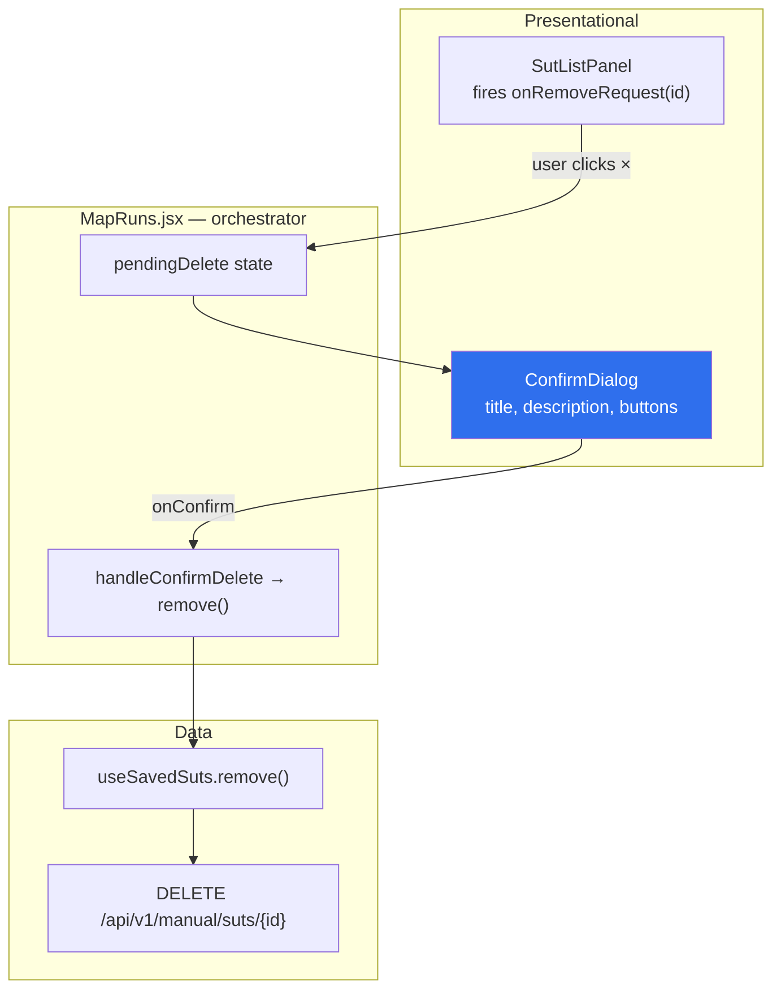
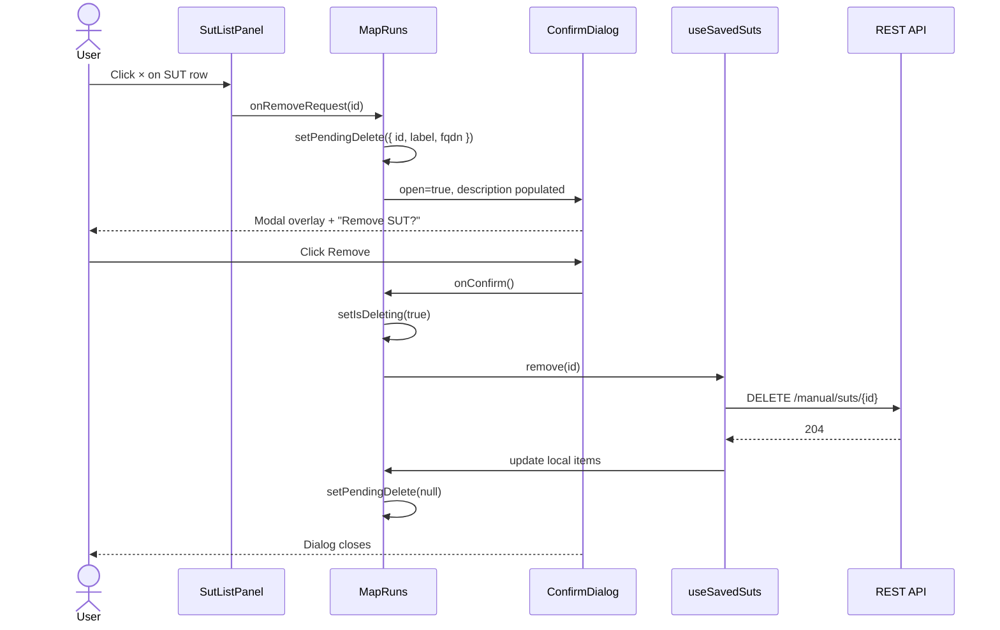

# Shared Confirm Dialog — Personal Interview Guide

> **Private learning doc** — lives in `docs/learning/personal/` (gitignored).  
> Project: SPPO Data 360 — `sppo-data-360-ui`  
> Written: July 2026

---

## 1. Executive summary (30-second pitch)

We added a **reusable confirmation dialog** so destructive actions (like removing a saved SUT) require an explicit user choice before the API is called. The pattern is **declarative**: each page owns `pendingAction` state, renders `<ConfirmDialog open={...} />` with runtime title/description, and only runs the delete/API call in `onConfirm`. The component is styled with **Tailwind v4 `@layer components`** (`dialog.css`), portaled to `document.body`, and accessible (`role="dialog"`, `aria-modal`, Escape to cancel). We deliberately **did not** use `window.confirm()` or a global context yet — the app is small enough that a shared presentational component plus page-level state is the right trade-off.

---

## 2. Why we implemented this

| Problem | Without confirm | With shared `ConfirmDialog` |
|---------|-----------------|---------------------------|
| Accidental SUT delete | One mis-click → immediate `DELETE` API | User must read message and click **Remove** |
| Inconsistent UX across pages | Each page might invent its own pattern | One component, one visual language |
| `window.confirm()` | Blocks main thread, unstyled, poor a11y | Custom modal, brand tokens, keyboard support |
| Logic coupling | Dialog mixed into list panel | Page orchestrates; panel stays presentational |

**Persistence contract (Map Runs):**

| Action | Touches Postgres `user_suts`? |
|--------|-------------------------------|
| **+ Add** / **Save to list** | `POST /manual/suts` — upsert bookmark |
| **Successful SSH connect** | `POST /manual/suts/connect` — upsert + `last_connected_at` |
| **Disconnect** / close terminal | No — session only |
| **Page refresh** | No — `GET /manual/suts` reloads bookmarks |
| **× Remove** → confirm **Remove** | `DELETE /manual/suts/{id}` — only path that deletes |

SUTs stay in the database until the user explicitly confirms removal. Nothing else auto-deletes.

**First consumer:** Manual → Map Runs — remove SUT (× button).

**Future consumers:** Delete workload runs, revoke access, discard unsaved form, etc.

---

## 3. High-level architecture (pictorial)

### 3.1 Responsibility split



### 3.2 Sequence — happy path (delete SUT)



### 3.3 Component map (repo)

```
sppo-data-360-ui/
├── src/components/ui/
│   └── ConfirmDialog.jsx          # Shared dialog (portal + a11y)
├── src/styles/components/
│   └── dialog.css                 # Tailwind @layer components
├── src/pages/sections/
│   └── MapRuns.jsx                # Owns pendingDelete + confirm handler
├── src/components/map-runs/
│   └── SutListPanel.jsx           # onRemoveRequest only (no API)
└── src/hooks/
    └── useSavedSuts.js            # Pure data — unchanged
```

---

## 4. Fundamentals — modals & confirmation UX

### 4.1 Modal vs inline banner

| Pattern | When to use |
|---------|-------------|
| **Modal dialog** | Irreversible or high-impact action; needs focused attention |
| **Inline banner** | Errors, info, non-blocking feedback (we already have `map-runs__banner--error`) |
| **Toast** | Success ack that doesn't need a decision |

Delete SUT is **irreversible** (bookmark removed from Postgres) → modal is correct.

### 4.2 Why `createPortal`?

Rendering into `document.body` avoids:

- `overflow: hidden` on parent grids clipping the overlay
- `z-index` stacking context fights (header is `z-60`, dialog is `z-70`)
- Focus traps breaking inside nested scroll areas

```jsx
return createPortal(<div className="dialog">…</div>, document.body)
```

### 4.3 Declarative vs imperative API

| Style | Example | When |
|-------|---------|------|
| **Declarative** (what we built) | `<ConfirmDialog open={…} onConfirm={…} />` | Page already has React state; few call sites |
| **Imperative** | `await confirm({ title: '…' })` via context | Many unrelated deep children need confirm |

**Interview line:** *Start declarative; promote to context only when prop-drilling or duplicate state becomes painful.*

### 4.4 Accessibility checklist

| Requirement | Our implementation |
|-------------|-------------------|
| `role="dialog"` + `aria-modal="true"` | On panel |
| Labelled title | `aria-labelledby` → `<h2 id={titleId}>` |
| Description | `aria-describedby` when `description` prop set |
| Focus | Cancel button focused on open |
| Escape | `keydown` listener → `onCancel` |
| Overlay click | Backdrop button → `onCancel` (disabled while `loading`) |
| Scroll lock | `document.body.style.overflow = 'hidden'` while open |

---

## 5. What we implemented (layer by layer)

### 5.1 `ConfirmDialog.jsx` props

| Prop | Type | Purpose |
|------|------|---------|
| `open` | `boolean` | Show/hide |
| `title` | `string` | Headline — e.g. "Remove SUT?" |
| `description` | `string?` | Runtime detail — SUT label + FQDN |
| `confirmLabel` | `string` | Default "Confirm"; Map Runs uses "Remove" |
| `cancelLabel` | `string` | Default "Cancel" |
| `variant` | `'default' \| 'danger'` | Primary button styling |
| `loading` | `boolean` | Disables buttons; shows "Working…" |
| `onConfirm` | `() => void \| Promise<void>` | Runs API action |
| `onCancel` | `() => void` | Closes without side effects |

### 5.2 `dialog.css` tokens

Reuses design system from `index.css` `@theme`:

- `--color-brand-card`, `--color-brand-line`, `--shadow-card`, `--radius-panel`
- `--color-status-fail` for danger confirm button
- `z-70` above app header (`z-60`)

### 5.3 Map Runs wiring

**State in page (not hook, not list panel):**

```jsx
const [pendingDelete, setPendingDelete] = useState(null) // { id, label, fqdn }
const [isDeleting, setIsDeleting] = useState(false)
```

**Request (open dialog):**

```jsx
const handleRemoveRequest = (id) => {
  const sut = suts.find((s) => s.id === id)
  if (!sut) return
  setPendingDelete({ id, label: sut.label || sut.fqdn, fqdn: sut.fqdn })
}
```

**Confirm (API only after user agrees):**

```jsx
const handleConfirmDelete = async () => {
  if (!pendingDelete) return
  setIsDeleting(true)
  try {
    await remove(pendingDelete.id)
    if (selectedId === pendingDelete.id) setSelectedId(null)
    setPendingDelete(null)
  } finally {
    setIsDeleting(false)
  }
}
```

**SutListPanel** renamed `onRemove` → `onRemoveRequest` — signals intent without performing delete.

---

## 6. Pattern for other pages (copy-paste recipe)

### Step 1 — Import

```jsx
import { ConfirmDialog } from '../../components/ui/ConfirmDialog'
```

### Step 2 — Page state

```jsx
const [pendingAction, setPendingAction] = useState(null)
const [isWorking, setIsWorking] = useState(false)
```

`pendingAction` shape is **page-specific** — store whatever you need for title/description (id, name, etc.).

### Step 3 — Request handler (from child button)

```jsx
const handleDeleteRequest = (item) => {
  setPendingAction({ id: item.id, label: item.name })
}
```

Pass `onDeleteRequest={handleDeleteRequest}` to the child — child does **not** call the API.

### Step 4 — Confirm handler

```jsx
const handleConfirm = async () => {
  if (!pendingAction) return
  setIsWorking(true)
  try {
    await deleteSomething(pendingAction.id)
    setPendingAction(null)
  } catch (err) {
    // show error banner — keep dialog open or close per UX choice
  } finally {
    setIsWorking(false)
  }
}
```

### Step 5 — Render dialog at page root

```jsx
<ConfirmDialog
  open={pendingAction !== null}
  title="Delete item?"
  description={pendingAction ? `Delete "${pendingAction.label}"?` : undefined}
  confirmLabel="Delete"
  variant="danger"
  loading={isWorking}
  onConfirm={handleConfirm}
  onCancel={() => { if (!isWorking) setPendingAction(null) }}
/>
```

### Anti-patterns to avoid

| Don't | Do instead |
|-------|------------|
| Put dialog inside scrollable list row | Portal at page level |
| Call API in list item `onClick` | `onXxxRequest` → page → dialog → API |
| Store dialog state in data hooks | Keep hooks for fetch/mutate only |
| Use `window.confirm()` | Shared `ConfirmDialog` |

---

## 7. Styling approach (Tailwind v4)

We follow the same convention as `feedback.css` and `map-runs.css`:

1. Define BEM-like classes in `src/styles/components/dialog.css`
2. Use `@apply` with theme tokens (`brand-card`, `status-fail`, etc.)
3. Import in `src/index.css`
4. Component uses **class names only** — no inline Tailwind strings in JSX

**Why not a UI library (Radix/Headless UI)?**

- App is small; one dialog type today
- No extra bundle dependency
- Full control over AMD/brand styling
- **Upgrade path:** swap internals to Radix Dialog later; keep the same page-level API

---

## 8. Interview Q&A

### UX / product

**Q: Why confirm delete for SUT bookmarks?**  
A: Removal is immediate and persisted in Postgres — accidental clicks are costly. Confirm dialogs are standard for irreversible actions.

**Q: Why not undo instead of confirm?**  
A: Undo is better when cheap to implement (soft delete, toast + revert). Our v1 is hard delete via API — confirm is simpler and honest about permanence.

### React architecture

**Q: Why state in `MapRuns` and not `useSavedSuts`?**  
A: Hooks own **data** (fetch, mutate, cache). UI flow (which dialog is open) is presentation concern — belongs on the page that composes components.

**Q: Why `onRemoveRequest` instead of `onRemove`?**  
A: Naming documents the contract: the panel **requests** removal; the page **authorizes** it after confirmation.

**Q: What if ten pages need confirm?**  
A: Keep one `ConfirmDialog` component. Optionally add `ConfirmDialogProvider` + `useConfirm()` that returns a Promise — same visual, imperative ergonomics.

### Accessibility

**Q: How do screen readers know it's a dialog?**  
A: `role="dialog"`, `aria-modal="true"`, labelled title, optional describedby for body text.

**Q: Keyboard support?**  
A: Escape cancels; focus moves to Cancel on open; buttons disabled during async `loading`.

### CSS / layering

**Q: Why `z-70`?**  
A: Header uses `z-60`, section nav `z-55`. Dialog must paint above chrome.

**Q: Why portal to body?**  
A: Map Runs grid uses `overflow: hidden` — in-tree modal would clip or stack incorrectly.

---

## 9. Counter-questions YOU can ask the interviewer

1. *"Do you standardize on a design-system modal or allow teams to bring their own?"*
2. *"How do you handle focus return after modal close for accessibility?"*
3. *"For destructive actions, do you prefer confirm modals, undo toasts, or soft-delete?"*
4. *"How do you test modal flows — RTL, Playwright, or Storybook interaction tests?"*

---

## 10. Glossary

| Term | Meaning |
|------|---------|
| **Portal** | React `createPortal` — render children into another DOM node |
| **Declarative** | UI is a function of state (`open={bool}`) |
| **Presentational component** | Renders UI; minimal logic; callbacks up |
| **Orchestrator page** | Composes children + owns cross-cutting UI state |
| **Danger variant** | Red confirm button for destructive actions |
| **Focus trap** | Keep Tab inside modal (v1: focus cancel on open; full trap is v2) |

---

## 11. Mental model — one paragraph for interviews

*“We introduced a shared ConfirmDialog for destructive actions. The list panel only emits onRemoveRequest; MapRuns holds pendingDelete state and renders a portaled modal with runtime title and description. The API DELETE runs only after the user confirms. Styling uses our Tailwind component layer and brand tokens. We avoided window.confirm and global context until we need them — the pattern is declarative, testable, and easy for other pages to copy: pending state, request handler, confirm handler, ConfirmDialog at page root.”*

---

## 12. File quick-reference

```
sppo-data-360-ui/src/components/ui/ConfirmDialog.jsx
sppo-data-360-ui/src/styles/components/dialog.css
sppo-data-360-ui/src/index.css                           # imports dialog.css
sppo-data-360-ui/src/pages/sections/MapRuns.jsx          # first consumer
sppo-data-360-ui/src/components/map-runs/SutListPanel.jsx
```

---

## 13. Related fixes in the same feature area

### CORS DELETE (infra)

When we first wired SUT delete, the browser blocked `DELETE` with a CORS preflight failure (`OPTIONS` returned 400). Root cause: FastAPI `CORSMiddleware` only allowed `GET` and `POST`. Fix: add `DELETE` and `OPTIONS` to `allow_methods` in `main.py`.

### Pre-modal × button (UX regression, now fixed)

Before `ConfirmDialog`, clicking **×** called `DELETE` immediately (carried over from localStorage-era “remove from list” UX). That matched localStorage semantics but was dangerous once bookmarks lived in Postgres — testing the × button during CORS/delete debugging could wipe real rows.

**After modal:** `DELETE` runs only when the user clicks **Remove** in the dialog. API logs show explicit `DELETE /api/v1/manual/suts/{id}` requests — each one is a deliberate confirm, not background cleanup.

**Danger variant safety:** `ConfirmDialog` disables the confirm button for 200ms after open so a fast double-action cannot accidentally confirm.

---

*End of guide — extend when adding ConfirmDialogProvider or additional variants (warning, info).*
