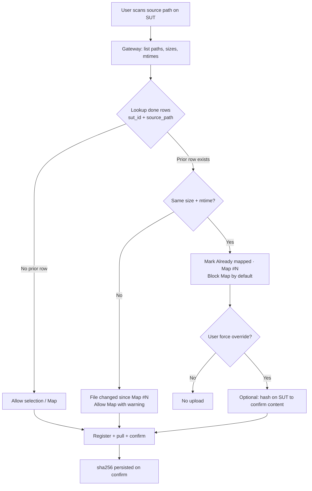

# Map Runs — Preventing duplicate uploads (personal learning)

> **Private learning doc** — lives in `docs/learning/personal/` (gitignored).  
> Project: SPPO Data 360 — Manual Execution → Map Runs (`/manual/map-runs`)  
> Written: 2026-07-26

**Related (product docs):**

- [map-runs-consolidation-problem-statement.md](../../map-runs/map-runs-consolidation-problem-statement.md)
- [map-runs-implementation-status.md](../../map-runs/map-runs-implementation-status.md)
- [map-runs-storage-grant-confirm-guide.md](../../map-runs/map-runs-storage-grant-confirm-guide.md)

---

## 1. The question (problem statement)

There are scenarios where a user may **accidentally or intentionally** try to map **already scanned files or subfolders again**.

**Example edge case:**

1. A user runs workloads on a particular SUT and always stores result files in a **fixed directory** (e.g. `/home/user/benchmark-results/`).
2. They return to Map Runs, enter that same path in **Source path on SUT**, scan, and map again — perhaps without checking history.
3. **Scanning** the directory is fine (discovery), but **upload should not be allowed** for files/folders that were already mapped earlier for that SUT.

**Design question:** How do we avoid duplicate uploads? **Can SHA-256 help prevent duplicate upload?**

---

## 2. What the codebase stores today

There is **no duplicate detection** implemented yet. Relevant registry fields:

| Field | Table | When set | Purpose |
|-------|-------|----------|---------|
| `source_path` | `manual_workloads` | Register | Scan root the user typed |
| `source_path` | `manual_workload_run_files` | Register | Absolute SUT path per file (audit) |
| `size_bytes` | `manual_workload_run_files` | Register / scan | Expected size from SFTP stat |
| `sha256` | `manual_workload_run_files` | **Confirm** (after gateway pull) | Content digest from SFTP read |
| `adls_path` | `manual_workload_run_files` | Confirm | Lake location `{map_id}/artifacts/{filename}` |

**Important timing detail:** At **scan time**, the gateway returns path, type, size, and mtime — **not** SHA-256. Hashing happens during **gateway pull** while streaming bytes, then Postgres is updated on **confirm**.

**Uniqueness today:** Only `(manual_workload_id, adls_path)` within a single map — **not** across maps or SUTs.

See migration `009_manual_workloads_tables.sql` and problem statement §7–§8 in `docs/map-runs/`.

---

## 3. What is SHA-256, what else exists, and why is it necessary?

This section explains the **building block** behind `manual_workload_run_files.sha256` — useful before diving into duplicate prevention.

### 3.1 What is a hash (digest)?

A **cryptographic hash function** takes input of **any size** (a file, a string, a zip) and produces a **fixed-length fingerprint** (the **digest**).

Properties that matter for Map Runs:

| Property | Meaning |
|----------|---------|
| **Deterministic** | Same bytes in → same digest out, every time |
| **Fixed size** | Output length is always the same (SHA-256 → 256 bits) |
| **One-way** | Cannot reconstruct the file from the digest |
| **Avalanche effect** | Tiny change in input → completely different digest |
| **Collision resistance** | Hard to find two different files with the same digest |

A hash is **not encryption** — it does not hide content; it **identifies** and **verifies** content.

**Analogy:** A hash is like a **strong fingerprint for data**. Two identical files share the same fingerprint; two different files (almost always) do not.

### 3.2 What is SHA-256 specifically?

**SHA-256** is one member of the **SHA-2** family (Secure Hash Algorithm), published by NIST.

| Aspect | Detail |
|--------|--------|
| **Output** | 256 bits → **64 hexadecimal characters** (e.g. `e3b0c44298fc1c149afbf4c8996fb92427ae41e4649b934ca495991b7852b855`) |
| **Input** | Any length — 10 bytes or 2 GB, same algorithm |
| **How computed** | Read file in chunks; update hasher per chunk (streaming) |
| **In our gateway** | `hashlib.sha256()` in Python while SFTP bytes stream to storage PUT |

In Map Runs, SHA-256 is stored in Postgres **only after upload confirm** — the gateway computed it while reading the file from the SUT, and the API persists it on `POST …/confirm`.

```text
SUT file bytes  →  SHA-256(hasher)  →  64-char hex  →  manual_workload_run_files.sha256
```

### 3.3 Other hash / checksum types (and why we did not pick them)

Many algorithms produce a “fingerprint”, but they differ in **purpose**, **strength**, and **output size**.

| Algorithm | Output (typical) | Type | Common use | Notes for Map Runs |
|-----------|------------------|------|------------|-------------------|
| **CRC32** | 32-bit hex | Checksum | Network packets, zip internal checks | Very fast; **not** cryptographic — easy to craft collisions; poor for trust/audit |
| **MD5** | 128-bit / 32 hex | Cryptographic hash (legacy) | Old file dedup, etag | **Deprecated** for security; collision attacks exist; avoid for new systems |
| **SHA-1** | 160-bit / 40 hex | Cryptographic hash (legacy) | Git objects (historically), TLS (old) | **Deprecated**; collision demonstrations exist |
| **SHA-256** | 256-bit / 64 hex | Cryptographic hash (current standard) | TLS, code signing, blob integrity, our registry | **Our choice** — widely supported, strong enough, fits `CHAR(64)` column |
| **SHA-384 / SHA-512** | 384 / 512 bits | SHA-2 family | High-security contexts | Longer digests; no meaningful gain for artifact dedup; more storage |
| **BLAKE2b / BLAKE3** | Variable | Modern fast hash | Databases, backups, some dedup systems | Faster than SHA-256 on CPU; less “default” in enterprise/Azure docs |
| **xxHash / MurmurHash** | 64–128 bit | Non-cryptographic hash | Databases, hash tables, speed | Great for **indexing**, not for **proving integrity** to auditors |

**Checksum vs cryptographic hash:**

- **Checksum** (e.g. CRC32): detects **accidental** bit flips (disk/network noise).
- **Cryptographic hash** (SHA-256): also designed to resist **intentional** collision finding — important when the digest is a **system of record**.

For benchmark artifacts that may be cited in audits or compliance discussions, a **cryptographic** hash is appropriate.

### 3.4 Why SHA-256 is necessary in Map Runs

Even before duplicate prevention, SHA-256 serves several roles in the capture pipeline:

| Role | Why it matters |
|------|----------------|
| **Integrity verification** | Confirms the bytes that landed in the lake are **exactly** what was read from the SUT (no truncation, corruption, or partial upload). |
| **Audit trail** | Postgres row can answer: “Map #1006’s `result.log` was digest `abc…` at upload time.” Supports traceability without re-reading the lake. |
| **Confirm handshake** | Grant → PUT → **confirm** pattern: client (gateway) reports `{ size_bytes, sha256 }`; API can reject mismatch vs registered size or storage stat. |
| **Content identity** | Same digest = same bytes (with overwhelming probability) — foundation for **duplicate detection** across maps and paths. |
| **Storage / cloud alignment** | Azure Blob and ADLS support MD5 and CRC64 for integrity; SHA-256 is a common choice in application registries and is familiar to security reviewers. |
| **Future content-addressed lake** | Optional path `{container}/{sha256}` or dedupe-before-PUT — digest becomes the primary key for blobs. |

**What SHA-256 does *not* do:**

- Does **not** tell you *which* map or path a file came from (that is `source_path`, `manual_workload_id`).
- Does **not** prove *when* a file was created on the SUT (that is `mtime` / `run_date`).
- Does **not** avoid reading the file — computing the hash requires **reading every byte** (done today during gateway pull, not during scan).

### 3.5 Why SHA-256 for this project (decision summary)

Problem statement (Round 3) locked **SHA-256 on gateway pull**. Rationale in one place:

1. **Standard** — Python `hashlib`, security reviews, and ADR-style docs all recognize SHA-256.
2. **Right size** — 64 hex chars map cleanly to `CHAR(64)` in Postgres with a format check.
3. **Strong enough** — Collision risk for accidental duplicate detection is negligible; no need for SHA-512.
4. **Streaming-friendly** — Gateway already streams SFTP → PUT; hashing in the same pass adds minimal overhead.
5. **Avoid legacy algorithms** — MD5/SHA-1 carry deprecation baggage even for non-adversarial lab use.

### 3.6 Plain-language recap

> **SHA-256** is a standard way to turn a file into a short, unique-ish **content ID**. We store it so we can prove what we uploaded, verify integrity at confirm time, and later ask “have we already ingested these exact bytes?” Duplicate prevention uses **path + size + mtime** early (cheap) and **SHA-256** when we need to be certain about **content** (after read or on demand).

---

## 4. The scenario decomposed

When a user re-scans a familiar directory, several cases exist:

| Case | What changed on SUT | Desired behaviour |
|------|---------------------|-------------------|
| **Accidental re-map** | Same files, unchanged | **Block** (or hard warn) |
| **New run, same layout** | Same paths, **new content** (overwritten logs) | **Allow** new Map # |
| **Intentional re-map** | Same files; user wants another Map # | Product decision: block vs “Map anyway” override |

Duplicate policy depends on which case matters most for v1.

---

## 5. Can SHA-256 prevent duplicates?

### 5.1 Where SHA-256 helps

- **Same bytes, any path:** Identical content → identical hash → strong dedup signal across maps.
- **After pull:** Gateway already computes SHA-256 incrementally during SFTP read; good for **post-upload audit** and cross-map content dedup in Postgres.
- **Lake dedup (future):** Avoid storing the same blob twice if storage is keyed or checked by hash before PUT.

### 5.2 Where SHA-256 is weak or too late

| Issue | Detail |
|-------|--------|
| **Too late at confirm only** | By confirm, SFTP read + PUT already happened; rejecting at confirm only avoids marking `done` — poor UX and wasted bandwidth. |
| **Not available at scan** | Scan lists path/size/mtime; hashing every file on scan means **full read over SSH** — expensive for large directories. |
| **Same path, new content** | Hash changes → correctly treated as new; a **path-only** rule would wrongly block. |
| **Same content, new path** | Hash matches; **path-only** rule would miss the duplicate. |
| **Folder / zip (future)** | Folder identity is a **set** of files or one archive hash — different rules than single-file dedup. |

### 5.3 Direct answer

**Yes**, SHA-256 can help prevent duplicate uploads of **identical content**, especially if checked **before or during Map** (not only at confirm).

**No**, SHA-256 alone is **not sufficient** for the “user always maps the same directory” story without also using **path, size, and mtime**, because:

- Hash is unknown at scan time today.
- Lab users often **reuse paths** with **new run data** — path-only blocking would be wrong; content-aware checks would be right.

**Best combination for this edge case:**

- **`(sut_id, source_path)` lookup** at scan/expand time for UX and blocking.
- Refine with **`size_bytes` / `mtime`** to detect “same path, updated file”.
- Use **SHA-256** to confirm true content duplicate or dedupe lake storage (optionally hash selected files on Map, not on every scan).

---

## 6. Practical dedup strategies

### 6.1 Path-based (recommended v1 gate)

**Rule:** For this **`sut_id`**, any file with `file_status = 'done'` and the same **`source_path`** is already mapped.

| Aspect | Detail |
|--------|--------|
| **When** | After scan or expand-folder, **before Map run** (paths are known). |
| **UI** | Mark rows “Already mapped · Map #1006”; disable selection or block Map with a list. |
| **Pros** | Cheap; matches “this file on this SUT”; no full file read over SSH. |
| **Cons** | Same path with **updated** run results looks like a duplicate unless size/mtime differ. |

**Refinement:** Treat as duplicate only if `(sut_id, source_path, size_bytes)` matches — and optionally **`mtime`** if persisted at first map.

If size or mtime changed → show **“File changed since Map #1006 — allow new map?”**

### 6.2 SHA-256 at selection time (stronger, costlier)

- On **Map** (or expand-folder), gateway hashes **selected files only** (not the whole tree at scan).
- Compare to `manual_workload_run_files.sha256` where `file_status = 'done'` for this `sut_id` (or globally, if product allows).
- **Pros:** Content-accurate.
- **Cons:** Extra SSH I/O; slower for large selections.

**Middle ground:** Hash only when path+size match a prior `done` row (confirm same content), or when user clicks Map.

### 6.3 Dedup scope (product)

| Scope | Question |
|-------|----------|
| **Per SUT** | “This file on this machine was already captured” — usually correct for the fixed-directory edge case. |
| **Per SUT + workload** | Same file mapped for DGEMM and again for SPEC CPU — allow or not? |
| **Global hash** | Same bytes on two SUTs — usually **allow** (different machines). |

The fixed-directory example suggests **per `sut_id`**, keyed by file `source_path` and/or hash — not necessarily by workload name.

### 6.4 Folder / subfolder re-map

Folder mode expands to many files. Dedup should run on the **expanded file list**:

| Overlap | Suggested UX |
|---------|----------------|
| All files already mapped | Block Map entirely |
| Partial overlap | Block, or allow only unmapped files (harder product-wise) |
| Messaging | “3 of 5 files already mapped (Map #1005, #1006)” |

SHA-256 helps when “these five paths = same five hashes as Map #1006”. For v1, **path + size + mtime** is often enough.

### 6.5 API / DB lookup (sketch)

After scan or expand, UI or API checks prior captures for the active SUT:

```sql
SELECT
    f.source_path,
    f.size_bytes,
    f.sha256,
    mw.id AS map_id,
    mw.completed_at
FROM sppo_data_360.manual_workload_run_files f
JOIN sppo_data_360.manual_workloads mw ON mw.id = f.manual_workload_id
WHERE mw.sut_id = :sut_id
  AND f.file_status = 'done'
  AND f.source_path = ANY(:paths);
```

Optional **strict** partial unique index (only if product never allows same path twice on same SUT, even when content changes):

```sql
CREATE UNIQUE INDEX ... ON (sut_id, source_path)
WHERE file_status = 'done';
-- Would require "force re-map" or new path when file is overwritten
```

---

## 7. Recommended direction (layered)

### Layer 1 — V1 dedup gate (scan / register)

- **Scope:** `sut_id` + `source_path`.
- **Compare:** `size_bytes` (and `mtime` if stored from scan).
- **UI:** Flag duplicates in scan results; **block Map** unless content changed or user confirms override.

### Layer 2 — SHA-256 role

- Keep as **source of truth after upload** (already implemented on confirm).
- Optionally on Map: hash only files that matched path+size to a prior `done` row.
- Longer term: content-addressed lake paths or dedupe-before-PUT (separate from Map # UX).

### Layer 3 — Do not hash everything on scan

- Full-tree hashing on every Scan is too heavy over SSH.
- Path (+ size/mtime) at scan; hash on demand at Map or after path match.

### Layer 4 — Product knobs

| Default | Override |
|---------|----------|
| Block accidental re-map with clear message: “`result.log` already mapped as Map #1006” | **“Map anyway”** for intentional re-capture or when size/mtime show the file changed |

---

## 8. Flow diagram (conceptual)



---

## 9. Open product questions (for ADR or problem statement update)

1. **Hard block vs warn + confirm** when path+size+mtime match a prior `done` row?
2. **Partial folder overlap** — block entire folder or map only new files?
3. **Same content, different workload name** — still duplicate for this SUT?
4. **Store `sut_mtime` on register** — migration + scan API already returns mtime; persist it?
5. **New API endpoint** — e.g. `POST /manual/workloads/check-duplicates` with `{ sut_id, files: [{ source_path, size_bytes, mtime }] }` vs enrich scan response server-side?

---

## 10. Summary (interview-style)

> “Scan is idempotent discovery; upload should be gated against the registry. SHA-256 is our content fingerprint **after** pull, but for the fixed-directory edge case we dedupe on **SUT + source path**, refined by **size and mtime**, and use SHA-256 to confirm identical bytes or dedupe storage — not as the only signal at scan time, because we don’t want to read every file on every scan.”

---

## Revision history

| Date | Change |
|------|--------|
| 2026-07-26 | Initial capture from Map Runs duplicate-upload brainstorm |
| 2026-07-26 | Added §3 — SHA-256 fundamentals, alternatives, and necessity |
