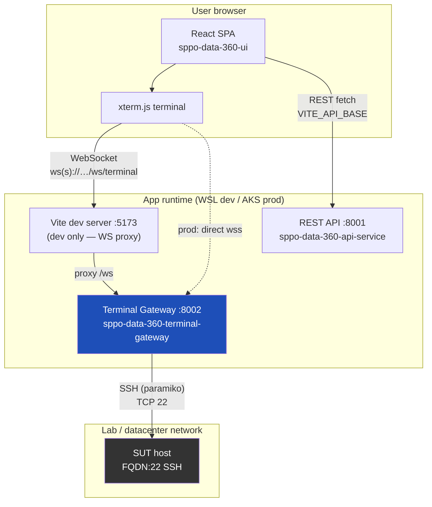
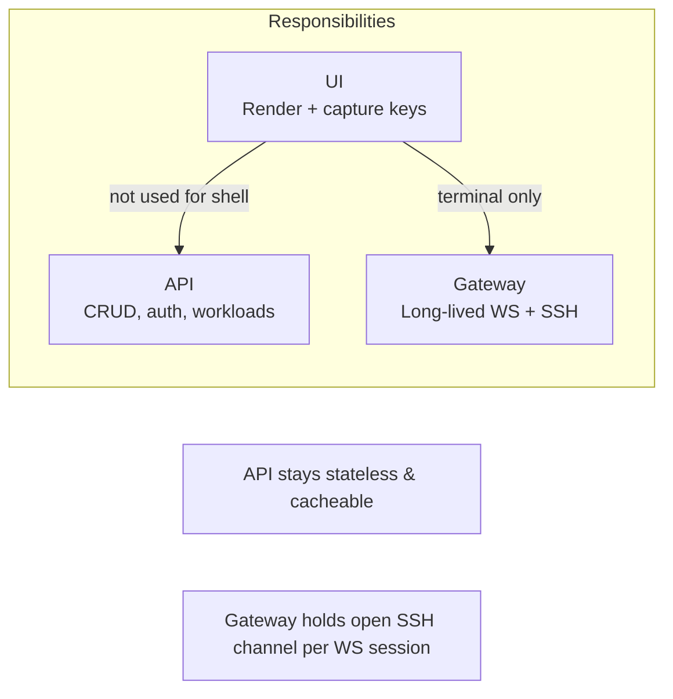
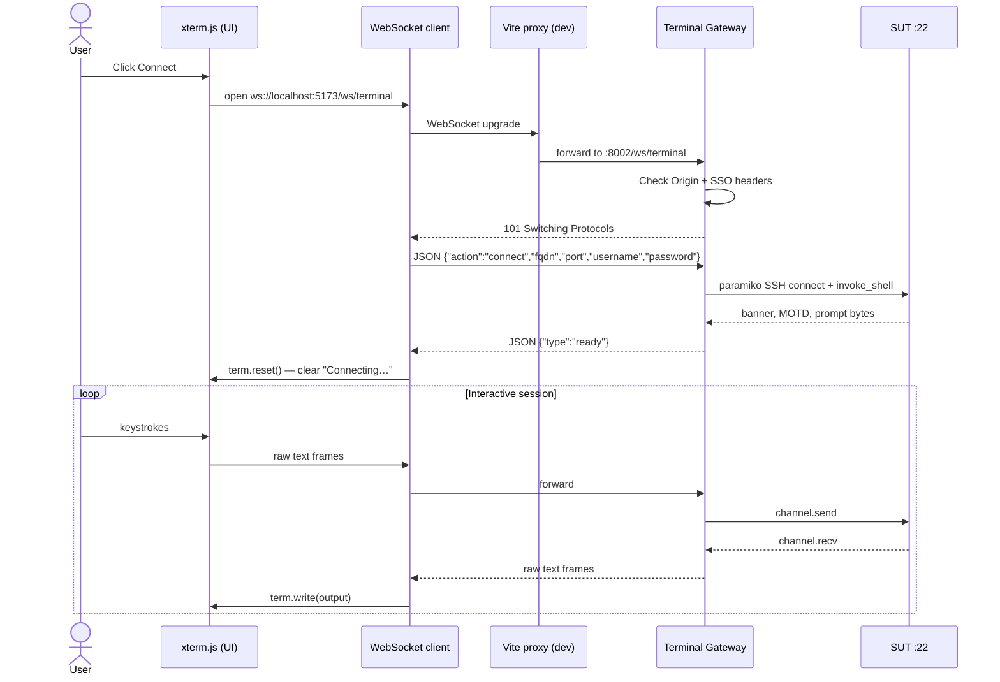
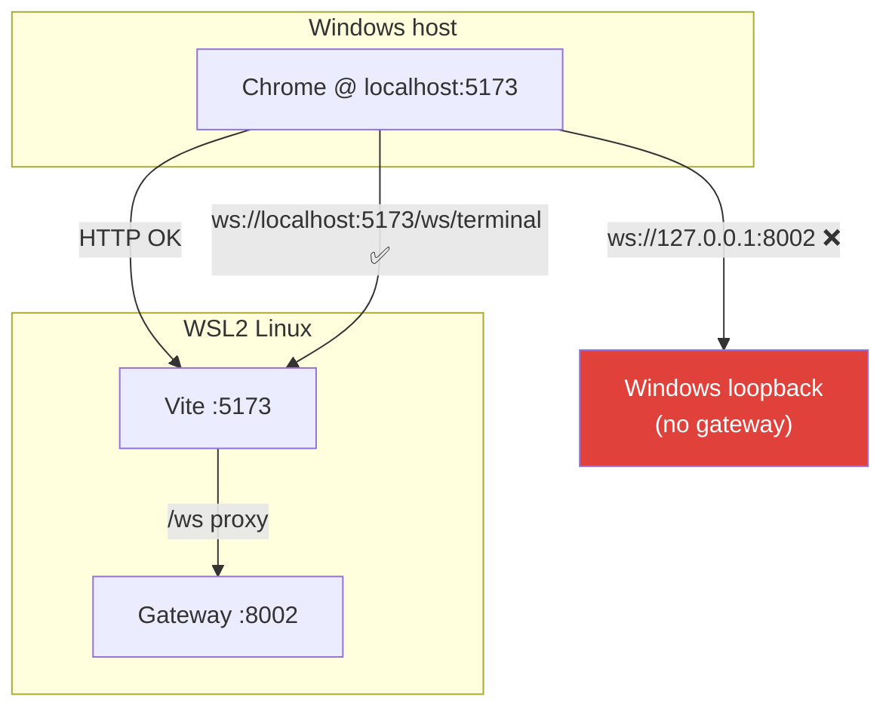
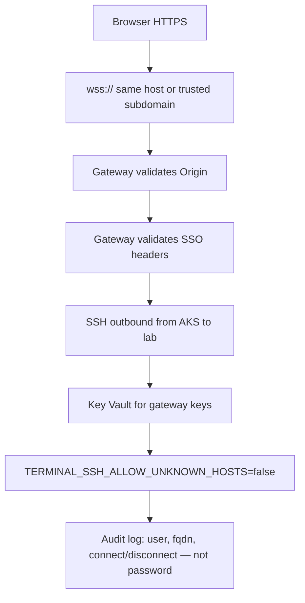

# Map Runs Terminal & WebSocket — Personal Interview Guide

> **Private learning doc** — lives in `docs/learning/personal/` (gitignored).  
> Project: SPPO Data 360 — Manual Execution → Map Runs (`/manual/map-runs`)  
> Written: July 2026

---

## 1. Executive summary (30-second pitch)

We built a **browser-based SSH terminal** (MobaXterm-style) for lab engineers to connect to Systems Under Test (SUTs) by FQDN. Browsers **cannot speak SSH natively**, so we introduced a **WebSocket-to-SSH gateway**: the React UI renders a terminal with **xterm.js**, opens a **WebSocket** to our gateway, and the gateway opens a **paramiko SSH session** to the target host and **bridges bytes both ways**. The REST API was intentionally **not** used for terminal I/O — long-lived, bidirectional streams belong on a dedicated service.

---

## 2. Why we implemented this

| Need | Why WebSocket + gateway |
|------|-------------------------|
| Interactive shell in the browser | HTTP request/response cannot stream keyboard input + live stdout |
| SSH to arbitrary lab FQDNs | Browser has no raw TCP/socket access to port 22 |
| SSO-aligned identity | Gateway validates same proxy headers as `GET /api/v1/me` |
| Azure production path | Static SPA + separate stateful gateway on AKS with outbound SSH to lab networks |
| Incremental delivery | UI shell first (demo), then real SSH, Postgres SUT bookmarks later |

**Product shape:** Left = saved SUT list, Centre = terminal, Right = reserved for future (e.g. ADLS artifact register).

---

## 3. High-level architecture (pictorial)

### 3.1 System context



### 3.2 Why three pieces (UI, API, Gateway)



**Interview line:** *Separating the gateway from FastAPI REST follows the single-responsibility principle — REST endpoints are wrong tool for a 45-minute interactive PTY session.*

### 3.3 Component map (repo)

```
SPPO_Landing_Dashboard/
├── sppo-data-360-ui/
│   ├── src/pages/sections/MapRuns.jsx          # 3-column page
│   ├── src/components/map-runs/
│   │   ├── SutListPanel.jsx                    # Left: bookmarks (localStorage v1)
│   │   ├── TerminalWorkspace.jsx               # Toolbar: user, password, connect
│   │   └── TerminalView.jsx                    # xterm mount + session lifecycle
│   └── src/lib/
│       ├── terminalSession.js                  # Strategy: WS vs demo shell
│       ├── terminalWebSocket.js                # WS client + protocol
│       ├── terminalLocalShell.js               # Offline demo fallback
│       └── sutStorage.js                       # localStorage (→ Postgres later)
│
└── sppo-data-360-terminal-gateway/
    └── src/sppo_data_360_terminal_gateway/
        ├── main.py                             # FastAPI + /ws/terminal
        ├── gateway/ws_handler.py               # WS auth, handshake, bridge
        ├── gateway/ssh_bridge.py               # paramiko PTY
        └── services/identity_service.py        # SSO headers
```

### 3.4 Sequence diagram — happy path



### 3.5 Dev vs production networking (WSL lesson)



**Key insight:** In WSL2, `127.0.0.1` in the browser is **Windows**, not WSL. Proxying through Vite keeps browser and gateway on the same logical entry point.

---

## 4. What is a WebSocket? (interview fundamentals)

| HTTP | WebSocket |
|------|-----------|
| Client asks, server answers, connection ends | Persistent, full-duplex channel |
| Unidirectional per request | Both sides can push anytime |
| Great for REST APIs | Great for chat, live dashboards, **terminals** |
| `fetch('/api/...')` | `new WebSocket(url)` after HTTP **Upgrade** handshake |

**Handshake (simplified):**

1. Client sends HTTP request with `Upgrade: websocket`
2. Server responds `101 Switching Protocols`
3. Same TCP connection now carries framed messages (text or binary)

**Our protocol on top:**

| Phase | Frame type | Payload |
|-------|------------|---------|
| Handshake | Text (JSON) | Client → `{"action":"connect",...}` |
| Handshake | Text (JSON) | Server → `{"type":"ready"}` or `{"type":"error","message"}` |
| Data | Text (raw) | Terminal bytes both directions |
| Teardown | Text (JSON) | Server → `{"type":"closed"}` optional |

We used **text frames** because xterm output is UTF-8 strings for our use case.

---

## 5. What we implemented (layer by layer)

### 5.1 Frontend

| Piece | Responsibility |
|-------|----------------|
| **xterm.js** | DOM terminal emulator — cursor, scrollback, ANSI colors |
| **FitAddon** | Resize terminal on container resize |
| **TerminalWorkspace** | SSH user + password fields, Connect/Disconnect, session snapshot |
| **terminalWebSocket.js** | WS lifecycle, handshake, `term.onData` → `ws.send` |
| **terminalSession.js** | `getTerminalWsUrl()` — env / dev proxy resolution |
| **sutStorage.js** | Per-user SUT bookmarks in `localStorage` (temporary) |

**Security choices (UI):**

- Password entered **only at connect time** — never stored in `localStorage`
- `VITE_*` env vars are build-time public — never put SSH secrets there

### 5.2 Terminal gateway (Python)

| Piece | Responsibility |
|-------|----------------|
| **FastAPI `@app.websocket("/ws/terminal")`** | Entry point |
| **ws_handler.py** | Origin check, identity, JSON connect, asyncio bridge |
| **ssh_bridge.py** | paramiko `SSHClient`, `invoke_shell(term='xterm')`, read/write |
| **identity_service.py** | `X-Forwarded-Email` etc. — same as REST API |

**Auth priority for SSH to SUT:**

1. Per-session `password` from connect JSON (user typed in UI)
2. Else `TERMINAL_SSH_KEY_PATH` on gateway host
3. Else `TERMINAL_SSH_PASSWORD` env (dev only)
4. Else SSH agent / default keys

### 5.3 Environment variables

| Variable | Where | Purpose |
|----------|-------|---------|
| `VITE_TERMINAL_WS_URL` | UI build | Production `wss://host/ws/terminal` |
| `VITE_API_BASE` | UI build | REST API origin |
| `TERMINAL_GATEWAY_PORT` | Gateway | Default 8002 |
| `TERMINAL_SSH_KEY_PATH` | Gateway | Server-side key to lab hosts |
| `TERMINAL_SSH_ALLOW_UNKNOWN_HOSTS` | Gateway | `true` dev, **`false` prod** |
| `CORS_ORIGINS` | Gateway | Allowed `Origin` on WS upgrade |

---

## 6. Issues we hit and how we fixed them

### Issue 1 — WebSocket connection failed (`ws://localhost:5173/ws/terminal`)

| Symptom | Console: WebSocket connection failed |
|---------|--------------------------------------|
| Cause | Terminal gateway not running on port 8002 |
| Fix | Start gateway: `fastapi dev ... main.py --port 8002` alongside `npm run dev` |

---

### Issue 2 — WebSocket failed (`ws://127.0.0.1:8002`) on WSL2

| Symptom | Gateway healthy inside WSL (`curl localhost:8002/health` OK) but browser fails |
|---------|----------------------------------------------------------------------------------|
| Cause | Browser on **Windows**; `127.0.0.1:8002` is **Windows** loopback, not WSL |
| Fix | Route dev traffic through Vite proxy: `ws://localhost:5173/ws/terminal` → proxy → WSL `:8002` |
| Lesson | **Always match where the browser points vs where the process listens** in WSL/Docker |

---

### Issue 3 — Missing SSH password

| Symptom | Auth failures or no way to authenticate |
|---------|------------------------------------------|
| Cause | Only username collected; gateway had no key/password |
| Fix | Password field in toolbar; sent once in connect JSON; not persisted |

---

### Issue 4 — Connection flicker / reconnect loop (subtle, important)

| Symptom | Ubuntu MOTD appears, then "Connecting to…" again while status still "Connected" |
|---------|-------------------------------------------------------------------------------------|
| Cause | React `useEffect` in `TerminalView` depended on `session` object and `onSessionEstablished` callback. After successful SSH: |
| | 1. `onSessionEstablished` → `recordSuccessfulConnect` → updates SUT list state |
| | 2. Parent re-renders → **new `session` object reference** + **new callback reference** |
| | 3. Effect cleanup **disposes WebSocket** → effect re-runs → **new connection** |
| Fix | **Session snapshot** — `activeSession` state set only on Connect, stable until Disconnect |
| Fix | **Callback refs** (`onEstablishedRef`) so parent updates don't retrigger effect |
| Fix | Effect deps: `[connected, session]` where `session` is stable snapshot, not inline object |
| Interview line | *This is a classic React + side-effect bug: never put non-memoized objects in effect dependency arrays when the effect owns long-lived connections.* |

---

### Issue 5 — Double `onClose` / spurious disconnect UI

| Symptom | Disconnect handler firing twice |
|---------|--------------------------------|
| Fix | `sessionEnded` guard flag; `dispose()` sets `disposed=true` before `ws.close()` so close handler ignores intentional teardown |

---

## 7. Design patterns & principles used

| Pattern / principle | Where | Interview phrasing |
|---------------------|-------|-------------------|
| **Gateway / BFF** | Dedicated `sppo-data-360-terminal-gateway` | Shield browser from SSH; centralize outbound lab access |
| **Strategy** | `attachTerminalSession()` picks WS vs demo shell | Swap transport without changing xterm component |
| **Bridge** | `ws_handler._bridge_io` — WS ↔ SSH channel | Convert two incompatible protocols |
| **Adapter** | paramiko wraps SSH; xterm wraps DOM terminal | |
| **Snapshot / value object** | `activeSession` at connect time | Immune to parent re-render identity churn |
| **Ref for stable callback** | `onEstablishedRef` in TerminalView | Avoid effect churn from inline callbacks |
| **Disposable resource** | `attachWebSocketShell` returns `{ dispose }` | Cleanup on unmount — like `useEffect` return |
| **Fail-fast validation** | Pydantic `ConnectMessage` | Reject malformed handshake early |
| **Separation of concerns** | UI ≠ API ≠ Gateway | Independent deploy, scale, timeout config |
| **12-factor config** | Root `.env`, `VITE_*` vs server secrets | |

**Anti-patterns we avoided:**

- Putting SSH passwords in Postgres or `localStorage`
- Open WebSocket relay without origin + SSO checks
- Bolting WebSocket onto the stateless REST API app

---

## 8. Security & production (Azure) checklist



| Topic | Dev | Production |
|-------|-----|------------|
| Transport | `ws://` + Vite proxy | **`wss://` only** |
| SSH host keys | Auto-add OK | Strict known_hosts |
| Password | User types per session | Prefer keys from Key Vault |
| Ingress | Local ports | WebSocket enabled, idle timeout 30–120 min, sticky sessions if multi-replica |
| Network | WSL port proxy | AKS → VNet/peering → lab firewalls (often hardest part) |

---

## 9. Local dev cheat sheet

```bash
# Terminal 1 — API
cd sppo-data-360-api-service && source .venv/bin/activate
APP_ENV=dev fastapi dev src/sppo_data_360_api/main.py --port 8001

# Terminal 2 — Gateway (required for real SSH)
cd sppo-data-360-terminal-gateway && source .venv/bin/activate
APP_ENV=dev fastapi dev src/sppo_data_360_terminal_gateway/main.py --port 8002

# Terminal 3 — UI
cd sppo-data-360-ui && npm run dev
# → http://localhost:5173/manual/map-runs
```

Verify:

```bash
curl http://127.0.0.1:8002/health
# DevTools → Network → WS → ws://localhost:5173/ws/terminal
```

---

## 10. Interview Q&A — questions they might ask you

### Architecture

**Q: Why not SSH directly from the browser?**  
A: Browsers sandbox JavaScript — no arbitrary TCP to port 22. You need a server-side component that speaks SSH and a browser-safe protocol (WebSocket) to reach it.

**Q: Why WebSocket instead of HTTP polling for terminal output?**  
A: Polling adds latency, wastes connections, and is awkward for keystroke-level interactivity. WebSocket is full-duplex and event-driven — industry standard for web terminals (GitHub Codespaces, AWS CloudShell, etc.).

**Q: Why a separate microservice instead of adding WS to the existing FastAPI API?**  
A: Different scaling profile (long-lived connections), different timeout/ingress config, different security boundary (outbound SSH to lab). Keeps REST API stateless and simple to cache/load-balance.

**Q: How does auth work on WebSocket?**  
A: During the HTTP Upgrade, the browser sends cookies and `Origin`. Our gateway reads the same SSO proxy headers (`X-Forwarded-Email`) as the REST API. Production rejects unauthenticated upgrades.

**Q: Where does the password go?**  
A: Once, in the first JSON message over an established WebSocket, used by paramiko for that session only — not logged, not stored in DB, not in `VITE_*`.

---

### WebSockets deep dive

**Q: What happens during a WebSocket handshake?**  
A: Client HTTP GET with `Connection: Upgrade`, `Upgrade: websocket`, `Sec-WebSocket-Key`. Server returns 101 with `Sec-WebSocket-Accept`. Connection upgrades from HTTP to framed WS protocol.

**Q: WebSocket vs SSE?**  
A: SSE is server→client only over HTTP. Terminal needs client→server keystrokes. WS is bidirectional.

**Q: How do you handle WebSocket behind a load balancer?**  
A: Enable WS on ingress; increase idle timeout; use session affinity (sticky) if gateway state is per-pod; or design shared session routing.

**Q: What close code 1006 means?**  
A: Abnormal closure — often “couldn't connect” (nothing listening, TLS mismatch, proxy dropped). We surfaced this in UI error messages.

---

### React / frontend

**Q: Why did the terminal flicker after connect?**  
A: `useEffect` re-ran because dependencies (`session` object, callbacks) changed after `recordSuccessfulConnect` updated parent state — disposed and recreated WebSocket. Fixed with session snapshot + callback refs.

**Q: Why xterm.js?**  
A: Mature terminal emulator in browser — handles ANSI escape codes, cursor, scrollback. Used by VS Code terminal component ecosystem.

**Q: How do you resize the terminal when the window changes?**  
A: `ResizeObserver` + xterm `FitAddon`. (Future: send `rows/cols` JSON to gateway for `channel.resize_pty`.)

---

### Backend / SSH

**Q: Why paramiko?**  
A: Pure Python SSH client — fits FastAPI asyncio stack (blocking connect/recv in `asyncio.to_thread`).

**Q: How does the bridge work?**  
A: Two async tasks: (1) read SSH channel → `ws.send_text`, (2) read WS messages → `channel.send`. `asyncio.wait(FIRST_COMPLETED)` — when one ends, cancel the other.

**Q: What if SSH is slow to produce output?**  
A: We poll `recv` with small sleep (20ms) when no data — avoids busy loop. Empty recv doesn't mean closed until `exit_status_ready`.

---

### Trade-offs / “what would you do differently?”

**Q: What’s v2?**  
A: Postgres `users` / `suts` / `user_suts` instead of localStorage; bastion/jump host support; PTY resize; audit table; rate limits per user; optional credential vault integration.

**Q: Biggest production risk?**  
A: **Network path** from AKS to lab SUTs — not the React code. Firewalls, peering, bastion.

**Q: Would you send password in WebSocket in prod?**  
A: Acceptable over **wss://** with SSO-protected gateway for v1; long-term prefer short-lived tokens or gateway-held keys + per-user RBAC on which FQDNs are allowed.

---

## 11. Counter-questions YOU can ask the interviewer

Shows depth:

1. *“Do you terminate WebSockets at the ingress or pass through to pods?”*
2. *“What’s your idle timeout for interactive sessions?”*
3. *“How do you prevent the terminal gateway from becoming an open SSH relay?”*
4. *“Do you use sticky sessions or a shared session store for WS?”*
5. *“How are outbound connections from the cluster to internal lab networks approved?”*

---

## 12. Glossary

| Term | Meaning |
|------|---------|
| **SUT** | System Under Test — lab machine under SSH |
| **PTY** | Pseudo-terminal — OS shell expects a TTY; `invoke_shell` creates one |
| **FQDN** | Hostname used for SSH target |
| **Gateway** | Our WS→SSH bridge service |
| **xterm** | Terminal emulator library |
| **paramiko** | Python SSH library |
| **Origin** | Browser header `http://localhost:5173` — CSRF/WS security check |
| **MOTD** | Message of the day — Ubuntu banner on login |
| **ADR** | Architecture Decision Record — project uses these for Postgres, Azure, etc. |

---

## 13. Mental model — one paragraph for interviews

*“I built a three-tier flow: React and xterm.js for UX, a dedicated FastAPI WebSocket gateway that validates SSO and bridges to paramiko SSH, and lab hosts reached only from the server side. We chose WebSocket because HTTP can’t carry interactive bidirectional terminal I/O. The interesting bugs were operational — WSL2 localhost routing — and React lifecycle — reconnect loops when parent state updated after connect. We fixed the latter with immutable session snapshots and stable effect dependencies. For Azure, the SPA is static; the gateway needs `wss://`, ingress WebSocket support, Key Vault keys, and lab network peering.”*

---

## 14. File quick-reference (copy-paste paths)

```
sppo-data-360-ui/src/lib/terminalWebSocket.js      # WS client
sppo-data-360-ui/src/lib/terminalSession.js        # URL resolution + strategy
sppo-data-360-ui/src/components/map-runs/TerminalView.jsx
sppo-data-360-ui/src/components/map-runs/TerminalWorkspace.jsx
sppo-data-360-ui/vite.config.js                    # /ws proxy (dev)
sppo-data-360-terminal-gateway/src/.../gateway/ws_handler.py
sppo-data-360-terminal-gateway/src/.../gateway/ssh_bridge.py
```

---

*End of guide — update this doc as you add Postgres SUT API, bastion support, or PTY resize.*
