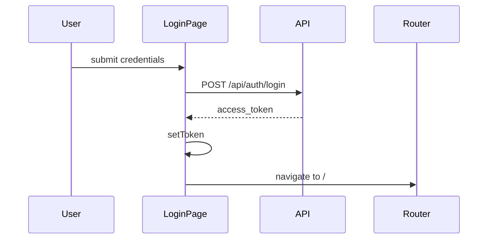

# Train of Thoughts — Frontend Plan

> **Parent document:** [PROJECT_BRIEF.md](../docs/architecture/PROJECT_BRIEF.md)

This plan defines the React SPA for Train of Thoughts. The frontend is a decoupled single-page application that consumes the FastAPI REST API. Server state is managed with TanStack Query; routing with React Router.

**Relevant ADRs:** ADR-001 (decoupled SPA), ADR-007 (TanStack Query for server state), ADR-008 (JWT auth in Phase 1), NFR-09 (no third-party analytics on note content).

**API contract:** [TOT_BACKEND.md](../tot-backend/TOT_BACKEND.md)

---

## Goals

1. Provide a usable personal UI for creating, reading, updating, deleting, and searching thoughts.
2. Support tags on thoughts (assign multiple tags per thought).
3. Authenticate with JWT (login page, protected routes).
4. Keep server state logic DRY via TanStack Query hooks.
5. Deploy as a static build to Azure Static Web Apps (Phase 5).

---

## Tech Stack

| Item | Choice |
|------|--------|
| Framework | React **19.2.7** |
| Language | **JavaScript (JSX)** |
| Node.js | **24** (pinned in `.nvmrc`; install via nvm) |
| Build tool | Vite |
| Routing | React Router v6 |
| Server state | TanStack Query v5 |
| HTTP | `fetch` with `import.meta.env.VITE_API_URL` |
| Linting | **ESLint** (flat config: `eslint.config.js`) |
| Styling | **Tailwind CSS** (recommended for v1) |

### Styling Decision

**Tailwind CSS v4** via `@tailwindcss/vite` — utilities live in **CSS files** under `src/styles/`, not as long inline `className` strings or `style={{}}` in JSX.

| Principle | Rule |
|-----------|------|
| **Semantic classes in JSX** | `className="thought-card"`, `className="btn btn-primary"` |
| **Appearance in CSS** | `@layer components` + `@apply` in `src/styles/components/*.css` |
| **Tokens** | Colors, fonts, content width in `src/styles/theme.css` (`@theme`) |
| **Reuse rule** | Third time you repeat the same utilities → move to a component CSS file |
| **No mixing** | Do not add CSS Modules on some pages and Tailwind layers on others |

**Optional:** `src/lib/cn.js` — merge class names for variants (e.g. selected tag chip).

See [QUESTION_ANSWER: Tailwind folder structure](../docs/QUESTION_ANSWER.md#2026-07-01-tailwind-styles-structure).

**Language:** **JavaScript with JSX** (`.jsx` / `.js` files). No `tsconfig` or TypeScript build step. Optional JSDoc in `api/shapes.js` documents API response shapes. Pin **`react` and `react-dom` at 19.2.7** (current release per [react.dev](https://react.dev)).

---

## Folder Layout

```text
tot-frontend/
├── TOT_FRONTEND.md
├── .nvmrc                      # Node 24 (see README)
├── package.json
├── vite.config.js              # @tailwindcss/vite plugin
├── eslint.config.js
├── index.html
├── .env.example                # VITE_API_URL=http://localhost:8000
├── public/
└── src/
    ├── main.jsx                # React root, QueryClientProvider, Router
    ├── App.jsx                 # Route definitions
    ├── index.css               # imports src/styles/index.css
    ├── styles/
    │   ├── index.css           # @import tailwindcss + partials
    │   ├── theme.css           # @theme design tokens
    │   ├── base.css            # body, headings, links
    │   ├── layouts.css         # app-shell, page, nav
    │   └── components/
    │       ├── buttons.css     # .btn, .btn-primary, …
    │       ├── forms.css         # .input, .textarea, .field, …
    │       ├── cards.css         # .thought-card, …
    │       ├── tags.css          # .tag-chip, …
    │       └── feedback.css      # .spinner, .alert, .empty-state
    ├── api/
    │   ├── client.js           # fetch wrapper, auth header, error parsing
    │   └── shapes.js           # JSDoc typedefs mirroring API response shapes
    ├── hooks/
    │   ├── useAuth.js          # login mutation, logout
    │   ├── useThoughts.js      # list query
    │   ├── useThought.js       # detail query
    │   ├── useThoughtMutations.js  # create, update, delete
    │   ├── useSearchThoughts.js
    │   └── useTags.js
    ├── pages/
    │   ├── LoginPage.jsx
    │   ├── ThoughtListPage.jsx
    │   ├── ThoughtDetailPage.jsx
    │   ├── ThoughtEditPage.jsx   # shared for create (/new) and edit
    │   └── SearchPage.jsx
    ├── components/
    │   ├── Layout.jsx            # nav, header, outlet wrapper
    │   ├── ProtectedRoute.jsx
    │   ├── ThoughtCard.jsx
    │   ├── ThoughtForm.jsx       # title, body, tags — used by create/edit
    │   ├── TagInput.jsx          # multi-tag entry with autocomplete
    │   ├── SearchBar.jsx
    │   ├── LoadingSpinner.jsx
    │   └── ErrorMessage.jsx
    └── lib/
        ├── auth.js               # token get/set/clear (localStorage v1)
        └── cn.js                 # optional className merge helper
```

---

## Environment

| Variable | Description |
|----------|-------------|
| `VITE_API_URL` | Base URL for API, e.g. `http://localhost:8000` (no trailing slash) |

Vite exposes only `VITE_*` vars to the client. Never put secrets in frontend env files.

---

## API Client (`api/client.js`)

```javascript
// Conceptual pattern
const baseUrl = import.meta.env.VITE_API_URL;

async function apiFetch(path, options = {}) {
  const token = getToken();
  const res = await fetch(`${baseUrl}${path}`, {
    ...options,
    headers: {
      "Content-Type": "application/json",
      ...(token ? { Authorization: `Bearer ${token}` } : {}),
      ...options.headers,
    },
  });
  if (!res.ok) throw await parseApiError(res);
  if (res.status === 204) return undefined;
  return res.json();
}
```

### API Functions

| Function | HTTP | Path |
|----------|------|------|
| `login(username, password)` | POST | `/api/auth/login` |
| `fetchThoughts(params)` | GET | `/api/thoughts?limit=&offset=&tag=` |
| `fetchThought(id)` | GET | `/api/thoughts/{id}` |
| `createThought(body)` | POST | `/api/thoughts` |
| `updateThought(id, body)` | PUT | `/api/thoughts/{id}` |
| `deleteThought(id)` | DELETE | `/api/thoughts/{id}` |
| `searchThoughts(q, params)` | GET | `/api/thoughts/search?q=&limit=&offset=` |
| `fetchTags()` | GET | `/api/tags` |
| `fetchHealth()` | GET | `/health` |

### Response shapes (`api/shapes.js`)

Document API shapes with JSDoc (no TypeScript compiler):

```javascript
/**
 * @typedef {Object} Thought
 * @property {string} id
 * @property {string} title
 * @property {string} body
 * @property {string} created_at
 * @property {string} updated_at
 * @property {string[]} tags
 */

/**
 * @typedef {Object} ThoughtCreate
 * @property {string} title
 * @property {string} body
 * @property {string[]} tags
 */

export {};
```

---

## Authentication

### Token Storage (v1)

- Store JWT in `localStorage` under a fixed key (e.g. `tot_access_token`).
- `lib/auth.ts`: `getToken()`, `setToken()`, `clearToken()`, `isAuthenticated()`.
- On `401` from API: clear token and redirect to `/login`.

### Login Flow



### Protected Routes

`ProtectedRoute` wraps authenticated pages:

- If no token → redirect to `/login` with `returnUrl` in location state.
- If token present → render children.

---

## TanStack Query Patterns (ADR-007)

### QueryClient Setup (`main.jsx`)

```javascript
const queryClient = new QueryClient({
  defaultOptions: {
    queries: {
      staleTime: 30_000,
      retry: 1,
    },
  },
});
```

### Query Keys

| Key | Used for |
|-----|----------|
| `['thoughts', { limit, offset, tag }]` | Paginated list |
| `['thought', id]` | Single thought detail |
| `['thoughts', 'search', { q, limit, offset }]` | Search results |
| `['tags']` | Tag autocomplete |

### Hooks

#### `useThoughts(limit, offset, tag?)`

- `useQuery` calling `fetchThoughts`.
- Returns `{ data, isLoading, error, refetch }`.

#### `useThought(id)`

- `useQuery` with `enabled: !!id`.
- Used on detail and edit pages.

#### `useThoughtMutations()`

- `useMutation` for create, update, delete.
- `onSuccess`: `queryClient.invalidateQueries({ queryKey: ['thoughts'] })` and invalidate `['thought', id]` when applicable.
- Navigate to detail or list after create/update as appropriate.

#### `useSearchThoughts(q, limit, offset)`

- `useQuery` with `enabled: q.length > 0` (or debounce in component).

#### `useTags()`

- `useQuery` for tag list; long `staleTime` (tags change infrequently).

#### `useAuth()`

- `useMutation` for login; `clearToken` on logout.

---

## Routing

| Path | Component | Auth |
|------|-----------|------|
| `/login` | `LoginPage` | Public |
| `/` | `ThoughtListPage` | Protected |
| `/thoughts/new` | `ThoughtEditPage` (create mode) | Protected |
| `/thoughts/:id` | `ThoughtDetailPage` | Protected |
| `/thoughts/:id/edit` | `ThoughtEditPage` (edit mode) | Protected |
| `/search` | `SearchPage` | Protected |
| `*` | Redirect to `/` | — |

```jsx
// App.jsx (conceptual)
<Routes>
  <Route path="/login" element={<LoginPage />} />
  <Route element={<ProtectedRoute><Layout /></ProtectedRoute>}>
    <Route index element={<ThoughtListPage />} />
    <Route path="thoughts/new" element={<ThoughtEditPage />} />
    <Route path="thoughts/:id" element={<ThoughtDetailPage />} />
    <Route path="thoughts/:id/edit" element={<ThoughtEditPage />} />
    <Route path="search" element={<SearchPage />} />
  </Route>
</Routes>
```

---

## Page Specifications

### LoginPage

- Form: username, password.
- Submit → `useAuth().login` → store token → navigate to `/`.
- Show API error message on failure.

### ThoughtListPage

- Paginated list of `ThoughtCard` components (title, excerpt, tags, updated date).
- Optional tag filter (dropdown or chip from `useTags`).
- Links: new thought, search, detail on card click.
- Loading and error states.

### ThoughtDetailPage

- Full title, body, tags, timestamps.
- Actions: Edit, Delete (confirm dialog).
- Delete → mutation → navigate to `/`.

### ThoughtEditPage

- Shared for create (`/thoughts/new`) and edit (`/thoughts/:id/edit`).
- `ThoughtForm`: title input, body textarea, `TagInput`.
- `TagInput`: suggest from `useTags`, allow new tag names.
- Submit → create or update mutation.

### SearchPage

- Search input (debounced ~300ms).
- Results list reusing `ThoughtCard`.
- Empty state when no query or no results.

### Layout

- Header: app title, nav links (Home, Search, New Thought).
- Logout button.
- Main content area (`<Outlet />`).
- Basic responsive: single column mobile, comfortable max-width on desktop.

---

## Component Notes

### ThoughtCard

- Displays title, truncated body, tag chips, relative `updated_at`.
- Click navigates to `/thoughts/:id`.

### TagInput

- Text input with chip display for selected tags.
- Autocomplete dropdown from `useTags` filtered by input.
- Enter or comma adds tag; backspace removes last chip.

### Error / Loading

- Consistent `LoadingSpinner` and `ErrorMessage` across pages.
- Query `isLoading` / `isError` / `error` drive UI.

---

## Vite Configuration

- **Dev server:** port `5173` (default); proxy to API optional but `VITE_API_URL` direct is fine with CORS.
- **Build:** `npm run build` → `dist/` for Static Web Apps.
- **Path alias (optional):** `@/` → `src/` for cleaner imports.

---

## Phased Implementation

### Phase 0 — Foundation

| Task | Exit signal |
|------|-------------|
| `npm create vite@latest` with **React (JSX)** template (`react`, not `react-ts`) | Dev server runs |
| Pin `react` and `react-dom` to **19.2.7** in `package.json` | `npm ls react` shows 19.2.7 |
| Add Tailwind via `@tailwindcss/vite` | Styles apply |
| `src/styles/` layered CSS (theme, layouts, components) | Semantic classes in JSX; no inline utilities |
| `fetchHealth()` on **Health** page (`/health`, `HealthCheck` component) | Displays API status from `/health` |
| `.env.example` with `VITE_API_URL` | Documented |

### Phase 3 — React UI

| Task | Exit signal |
|------|-------------|
| React Router + `Layout` + `ProtectedRoute` | Navigation works |
| `api/client.js` + `api/shapes.js` (JSDoc) | Documented API shapes; client calls work |
| Auth: login page + token storage | Can log in against local API |
| TanStack Query hooks for thoughts/tags | Data loads in UI |
| ThoughtListPage, DetailPage, EditPage | CRUD in browser |
| SearchPage | Keyword search works |
| TagInput with autocomplete | Tags assignable on create/edit |
| Responsive layout | Usable on mobile width |

**Phase 3 exit criteria:** End-to-end CRUD in browser against local API.

### Phase 5 — Azure Deployment

| Task | Exit signal |
|------|-------------|
| GitHub Actions build job | `dist/` artifact |
| Deploy to Azure Static Web Apps | Production URL loads |
| `VITE_API_URL` set to App Service URL at build time | API calls succeed over HTTPS |
| SWA routing: fallback to `index.html` for SPA routes | Deep links work |

---

## Accessibility and UX (v1 baseline)

- Form inputs have associated `<label>` elements.
- Focus visible on interactive elements.
- Delete confirmation before destructive action.
- Keyboard: Enter submits forms; Escape closes dialogs if added.

---

## Out of Scope (v1)

Per [PROJECT_BRIEF.md](../docs/architecture/PROJECT_BRIEF.md) MVP:

- Sharing thoughts with other users
- AI features
- Offline / PWA
- Real-time sync
- Email notifications
- Third-party analytics on note content (NFR-09)

---

## Security Notes

- JWT in `localStorage` is acceptable for a single-user personal app; consider `httpOnly` cookies if threat model changes.
- Never log or send note content to external analytics.
- All API calls over HTTPS in production (NFR-05).

---

## Cross-References

| Document | Relationship |
|----------|--------------|
| [TOT_BACKEND.md](../tot-backend/TOT_BACKEND.md) | REST API endpoints and auth |
| [TOT_DB.md](../tot-db/TOT_DB.md) | Data model (indirect, via API) |
| [PROJECT_BRIEF.md](../docs/architecture/PROJECT_BRIEF.md) | Vision, NFRs, phases |
